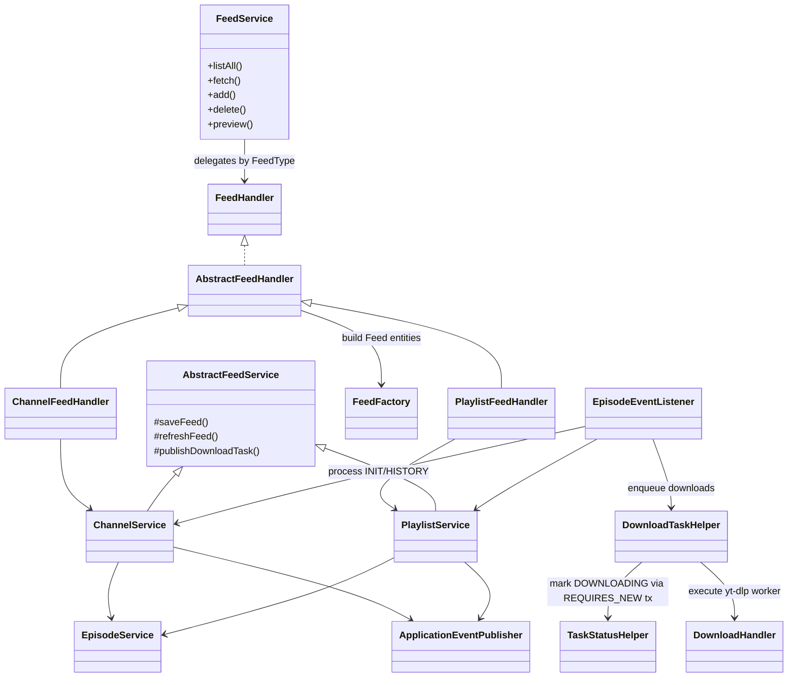

# PigeonPod Architecture

## 1. Background & Goals

- **Purpose**: Self-hosted bridge between YouTube and podcast clients, turning playlists/channels into RSS feeds with downloadable audio or video assets.
- **Goals**: Keep single-node deployments simple, automate ingestion/downloading, surface multilingual UX, and maintain a structure that solo maintainers (or AI copilots) can extend without reverse-engineering.

## 2. Capabilities

- One-click subscription for channels or playlists with `FeedService.fetch` + UI preview; `EditFeedModal` exposes keyword/duration filters, max episode budgets, audio/video presets, and custom titles/covers.
- Simplified subscription flow: channels fetch a fixed 50 episodes (1 page), playlists fetch all episodes and persist them all; `initialEpisodes` only controls the number of episodes to auto-download on first subscription (default 10), with remaining episodes saved as `READY` status (metadata only). Users can manually download additional episodes on-demand from the Feed detail page.
- Scheduled incremental sync: `ChannelSyncer`/`PlaylistSyncer` periodically refresh subscriptions, automatically fetching new episodes and triggering auto-downloads based on `initialEpisodes`; historical episodes can be manually fetched via the "Fetch History Episodes" button on the Feed detail page.
- Audio or video downloads via yt-dlp with normalized file names, per-feed audio quality (0–10), video quality, and encoding choices; cover images can be uploaded, cached, and cleared.
- Global player: built with Plyr and React-Plyr, audio plays in a fixed bottom bar, video plays in a centered modal; users can play downloaded audio/video content directly from the Feed detail page, while undownloaded episodes link to YouTube.
- RSS generation (channels + playlists) through Rome/iTunes modules, fronted by API keys; enclosure URLs proxy `/media/{episodeId}.{ext}` streams with MIME enforcement.
- Account surface lets the root user rotate usernames/passwords, mint API keys, store YouTube API keys (cached by `YoutubeApiKeyHolder`), and upload/delete cookies used for member-only content.
- End-to-end localization (Spring `MessageSource` + i18next) plus responsive Mantine UI, including live download status polling and copy-to-clipboard fallbacks.
- Operational helpers: `DownloadScheduler` keeps workers full, `EpisodeCleaner` prunes beyond `maximumEpisodes`, `StaleTaskCleaner` fixes stuck tasks on boot, and `VersionUpdateAlert` nudges admins about upstream releases.

## 3. Technology Stack

| Layer | Technologies |
| --- | --- |
| Backend | Java 17, Spring Boot 3.5 (Web, Scheduling, Async, Retry), MyBatis-Plus, SQLite (WAL mode), Flyway, Sa-Token (session + API key), Rome + iTunes modules, YouTube Data API v3, yt-dlp |
| Frontend | React 19, Vite 7, Mantine 8, Mantine DataTable, React Router v6, Mantine Notifications, i18next, Axios, Tabler Icons, Plyr, React-Plyr |
| Tooling / Infra | Maven, Node.js, Docker Compose, GitHub Releases (version check), local filesystem for `data/audio` & `data/cover` |

## 4. Repository Layout

- `backend/`: Spring Boot project  
  - `src/main/java/top/asimov/pigeon/controller`: `AuthController`, `AccountController`, `FeedController`, `EpisodeController`, `MediaController`, `RssController`, `SpaErrorController`.  
  - `service`: domain logic (`FeedService`, `ChannelService`, `PlaylistService`, `EpisodeService`, `MediaService`, `AccountService`, `AuthService`, `CookiesService`, `RssService`, `FeedFactory`, `FeedHandler`).  
  - `handler`: `ChannelFeedHandler`, `PlaylistFeedHandler`, `DownloadHandler`, `AbstractFeedHandler`, `FeedEpisodeHelper`.  
  - `helper`: YouTube helpers (`YoutubeHelper`, `YoutubeChannelHelper`, `YoutubePlaylistHelper`, `YoutubeVideoHelper`), download helpers (`DownloadTaskHelper`, `TaskStatusHelper`).  
  - `scheduler`: `ChannelSyncer`, `PlaylistSyncer`, `DownloadScheduler`, `EpisodeCleaner`, `StaleTaskCleaner`.  
  - `event` & `listener`: `DownloadTaskEvent`, `EpisodesCreatedEvent`, `EpisodeEventListener`.  
  - `config`: async executors, locale resolver, MyBatis-Plus config, Sa-Token adapters, `YoutubeApiKeyHolder`.  
  - `mapper`: MyBatis mappers for channels, episodes, playlists, playlist-episode links, users.  
  - `model`: entities, enums, DTOs, constants.  
  - `src/main/resources/db/migration`: Flyway migrations (V1…V16 plus repeatable scripts) describing the schema evolution.
- `frontend/`: Vite React app  
  - `src/components`: shared UI (Header, Layout, LoginForm, VersionUpdateAlert, EditFeedModal, CopyModal, GlobalPlayer).  
  - `src/pages`: `Home`, `Feed`, `UserSetting`, `Forbidden`, `NotFound`.  
  - `src/context/User`: User context, reducer, provider for auth state.  
  - `src/context/Player`: PlayerContext, PlayerProvider, managing global player state (current episode, play/pause, maximize/minimize, etc.).  
  - `src/helpers`: API instance, history helper, utility/notification helpers.  
  - `src/constants`, `src/locales`, `src/theme`, `src/assets`.  
  - `vite.config.js` configures the dev proxy for `/api` and `/media`.
- `documents/`: multilingual docs (architecture, audio/video guides, onboarding guides).  
- `data/`: default location for audio files and feed covers (mounted when running locally or via Docker).  
- `release/`: helper artifacts for packaging (logo, scripts).  
- Root also contains `Dockerfile`, `README.md`, and CI-friendly metadata.

## 5. Architecture Overview

1. **Controller layer**: REST endpoints live under `/api/**` and `/media/**`. `SaCheckLogin` guards feed/episode/account ops, `SaCheckApiKey` wraps the RSS endpoints, and `SpaErrorController` forwards GET `/error` responses to the SPA index to support client-side routing.
2. **Domain services & factories**: `FeedService` resolves `FeedType` and routes everything to registered `FeedHandler` implementations. `ChannelService` and `PlaylistService` extend `AbstractFeedService`, which contains the Template Method for save/update/refresh, publishes `DownloadTaskEvent`s, and normalizes `initialEpisodes`. `EpisodeService`, `MediaService`, `AccountService`, `AuthService`, and `CookiesService` encapsulate their subdomains.
3. **Handlers & helpers**:  
   - `ChannelFeedHandler` and `PlaylistFeedHandler` inherit `AbstractFeedHandler`, use `FeedFactory` to materialize entities from payloads, and call the respective services.  
   - `DownloadHandler` wraps yt-dlp execution, temp cookie files, metadata embedding, retry counters, and output sanitization.  
   - `YoutubeHelper` resolves channel/playlist identifiers; `YoutubeChannelHelper`, `YoutubePlaylistHelper`, and `YoutubeVideoHelper` orchestrate paginated API calls, filtering, and Episode creation.  
   - `DownloadTaskHelper` + `TaskStatusHelper` isolate queue submission and `REQUIRES_NEW` status flips (PENDING/FAILED → DOWNLOADING) before dispatching to `downloadTaskExecutor`.
4. **Events, schedulers, and async infrastructure**:  
   - `EpisodesCreatedEvent` is fired after episodes are persisted; `DownloadTaskEvent` carries INIT/HISTORY commands for channels or playlists.  
   - `EpisodeEventListener` listens `AFTER_COMMIT`, enqueues download tasks, and asynchronously triggers long-running channel/playlist operations (`processChannelInitializationAsync`, `processPlaylistDownloadHistoryAsync`, etc.).  
   - `AsyncConfig` defines `downloadTaskExecutor` (3 threads, no queue) and `channelSyncTaskExecutor` (2 threads) for the async tasks above.  
   - `ChannelSyncer`/`PlaylistSyncer` run hourly to detect stale `lastSyncTimestamp`s; `DownloadScheduler` runs every 30 seconds to keep downloader threads busy (prioritizing PENDING then FAILED<3 retries); `EpisodeCleaner` runs every 2 hours to enforce per-feed `maximumEpisodes`; `StaleTaskCleaner` runs once at startup to turn orphaned DOWNLOADING rows back to PENDING.
5. **Persistence**: MyBatis-Plus mappers handle CRUD plus custom SQL (e.g., window-function cleanup inside `EpisodeMapper.deleteEpisodesOverChannelMaximum`). Flyway migrations keep SQLite schema reproducible.
6. **Frontend SPA**: React app bootstrapped in `src/main.jsx` (i18n init → `UserProvider` → `BrowserRouter` → `MantineProvider` + `Notifications`). `Home` renders feed cards and Modal-driven onboarding, `Feed` surfaces the episode timeline with lazy loading + live status polling, `UserSetting` manages account data, and shared components keep header/auth/version logic reusable.

### Service Layer Relationships

## 6. Data Model

- **Feed (abstract)**: `id`, YouTube `source`, default/custom titles and covers (`customTitle`, `customCoverExt`, derived `customCoverUrl`), keyword filters split between title and description, `minimumDuration`, `initialEpisodes`, `maximumEpisodes`, download knobs (`DownloadType`, `audioQuality`, `videoQuality`, `videoEncoding`), sync markers (`lastSyncVideoId`, `lastSyncTimestamp`), timestamps (`subscribedAt`, `lastUpdatedAt`). `FeedType` distinguishes channels vs playlists.
- **Channel / Playlist**: Channels include a `handler` (for @handle lookups); playlists store `ownerId` + `episodeSort`. Both inherit feed configuration plus Template-Method hooks used by their services.
- **Episode**: Primary key is the YouTube video ID. Each row tracks `channelId`, title/description, publish timestamp, default/high-res covers, ISO 8601 `duration`, `downloadStatus` (`READY`, `PENDING`, `DOWNLOADING`, `COMPLETED`, `FAILED`, where `READY` indicates metadata-only, not yet queued for download), `mediaFilePath`, `mediaType`, `errorLog`, `retryNumber`, and `createdAt`.
- **PlaylistEpisode**: Join table mapping playlists to episodes with their own `id`, `playlistId`, `episodeId`, `coverUrl`, and `publishedAt` (so playlists can re-use existing episode rows while preserving playlist order).
- **User**: `id`, `username`, salted+hashed `password`, `salt`, `apiKey`, `youtubeApiKey`, `cookiesContent`, timestamps, plus transient fields for `newPassword` and `token`. User ID `0` is the “system” owner that stores the YouTube API key and cookies consumed by downloads.

## 7. Core Flows

1. **Subscription onboarding**  
   - `FeedController.fetch` calls `FeedService.fetch`, which guesses the feed type from the source (playlist heuristics) and forwards to the right handler. `ChannelFeedHandler`/`PlaylistFeedHandler` call the YouTube helpers to pull channel metadata and the last 5 episodes for preview.  
   - When the admin confirms, `FeedController.add` routes to `FeedService.add → FeedHandler.add → ChannelService/PlaylistService.saveFeed`. `AbstractFeedService` normalizes `initialEpisodes` (default 10): channels fetch a fixed 1 page (50 episodes), playlists fetch all episodes, and all episodes are persisted. The first `initialEpisodes` episodes are marked as `PENDING` and trigger download, while remaining episodes are marked as `READY` status (metadata only). The `DownloadTaskEvent(INIT)` is emitted to background workers for async initialization.
2. **Incremental sync**  
   - `ChannelSyncer` and `PlaylistSyncer` run hourly, ask their services for `findDueForSync(now)` results (based on `lastSyncTimestamp` or `episodeSort` rules), then call `refreshChannel/refreshPlaylist`. The refresh method fetches new YouTube videos until it hits `lastSyncVideoId`, stores rows through `EpisodeService.saveEpisodes`, updates sync markers, and fires an `EpisodesCreatedEvent`. New episodes are automatically downloaded (first N episodes set to `PENDING`) or saved as `READY` based on the `initialEpisodes` setting.  
   - History episode fetching: Users can click the "Fetch History Episodes" button on the Feed detail page (calls `/api/feed/{type}/history/{feedId}`), triggering `ChannelService.fetchHistoryEpisodes` or `PlaylistService.fetchHistoryEpisodes`, which fetch more historical episodes from before the earliest episode's publish date. All fetched episodes are saved as `READY` status for on-demand manual downloading.
3. **Download pipeline**  
   - `EpisodeEventListener.handleEpisodesCreated` receives committed IDs, iterates through them, and calls `DownloadTaskHelper.submitDownloadTask`. The helper flips the row to DOWNLOADING within a `REQUIRES_NEW` transaction (`TaskStatusHelper.tryMarkDownloading`), then submits a runnable to `downloadTaskExecutor`.  
   - `DownloadHandler.download` resolves whether the episode belongs to a playlist or channel to pick naming/downloading options, optionally writes a temp cookies file via `CookiesService`, constructs yt-dlp CLI args (audio vs video mode, quality and encoding), sanitizes file/dir names, embeds metadata/chapters, and updates `mediaFilePath`, `mediaType`, `errorLog`, and `retryNumber` with retry semantics. Temp cookies get deleted in `finally`.  
   - `DownloadScheduler` keeps the worker pool saturated by finding the oldest PENDING episodes, topping up with FAILED rows that have `retryNumber < 3`, and attempting to submit them (if submission fails due to a full pool, statuses are rolled back to PENDING). `StaleTaskCleaner` runs at startup to demote any DOWNLOADING rows that were left behind by a crash.  
   - Manual download: The UI allows manual download of `READY` status episodes. `EpisodeController.downloadEpisode` calls `EpisodeService.manualDownloadEpisode`, which updates the status to `PENDING` and publishes `EpisodesCreatedEvent`, following the same pipeline as auto-downloads. Failed episodes can be retried (`retryEpisode`), and pending episodes can be cancelled (`cancelEpisode`, resetting status to `READY`).  
   - `EpisodeCleaner` periodically executes a window-function delete so each channel honors its `maximumEpisodes`. The SQL only trims COMPLETED rows, preserving current downloads.
4. **RSS & media delivery**  
   - `RssController` exposes `/api/rss/{channelIdentification}.xml` and `/api/rss/playlist/{playlistId}.xml`. Both endpoints require an API key managed by `SaApiKeyDataLoaderImpl`, so secrets never live in query params until subscription time. `RssService` builds the Rome feed, injects iTunes metadata, and uses `pigeon.base-url` to form enclosure URLs.  
   - `MediaController` exposes `/media/feed/{feedId}/cover` (custom cover streaming) and `/media/{episodeId}.{ext}` for inline audio/video. `MediaService` validates MIME types, ensures files live under allowed directories, and sets proper headers/filenames.

## 8. Frontend–Backend Collaboration

- `frontend/src/helpers/api.js` builds a shared Axios instance; request interceptors add `Accept-Language` (from i18next), response interceptors funnel errors through `showError`. HTTP 401 responses trigger a logout redirect so Sa-Token sessions and localStorage stay in sync.
- `UserContext` + `UserProvider` wrap the app, hydrating from `localStorage` and exposing a reducer with `login`/`logout`. `PlayerContext` + `PlayerProvider` manage global player state (`currentEpisode`, `feedTitle`, `isPlaying`, `isMaximized`, etc.) and provide `play`, `pause`, `close`, `toggleMaximize` methods. Mantine `Notifications` and `GlobalPlayer` are mounted once in `main.jsx` for global toasts and playback.
- `GlobalPlayer` component is built with Plyr: audio displays in a fixed bottom bar (with cover, title, Plyr controls), video automatically opens in a centered modal; both support full controls (progress, volume, playback speed, etc.). Users can close the player to stop playback.
- `Home` (`pages/Home/index.jsx`) loads `/api/feed/list`, renders Mantine cards, and drives onboarding: `fetchFeed` calls `/api/feed/fetch` and opens a preview modal, `addFeed` posts to `/api/feed/{type}/add`, and `EditFeedModal` updates filters/download settings with live preview requests. `VersionUpdateAlert` (rendered at the top) queries GitHub releases at most every 30 minutes (timestamp stored under `update_check`), persists dismissals, and links to changelogs.
- `Feed` detail (`pages/Feed/index.jsx`) pulls `/api/feed/{type}/detail/{id}` plus paginated `/api/episode/list/{feedId}` data (channels use straight Episode queries, playlists join via `PlaylistEpisodeMapper`). It implements infinite scrolling via `IntersectionObserver`, color-coded status badges, API key-protected RSS generation (`/api/feed/{type}/subscribe/{id}`), custom-title/cover modal (uses `/api/feed/{type}/{id}/cover` and `PUT /api/feed/{type}/config/{id}`), delete feed, manual download/retry/cancel episodes (`/api/episode/download/{id}`, `/api/episode/retry/{id}`, `/api/episode/cancel/{id}`), fetch history episodes (`/api/feed/{type}/history/{id}`), and direct playback of downloaded episodes. Episode cards have a play button overlay on the cover; clicking it calls `PlayerContext.play()` to trigger the global player; undownloaded episodes link to YouTube instead. Active downloads are polled every 3 seconds by POSTing IDs to `/api/episode/status`; results patch only the status/error fields to keep pagination stable.
- `UserSetting` surfaces account operations through `AccountController`: username changes, password reset (`/api/account/reset-password`), API key generation (with localStorage update), YouTube API key storage (keeps `YoutubeApiKeyHolder` fresh), and cookies upload/delete (reads `.txt` into JSON; backend stores plaintext but writes temp files per download).
- `Header` hosts language switching (touching localStorage and i18next), Mantine color-scheme toggle (`useMantineColorScheme`), GitHub link, and the user menu (settings/logout). `LoginForm` handles session creation with form validation and warns when redirected due to `?expired=true`.
- `CopyModal` provides a manual fallback when insecure contexts prevent clipboard writes. `helpers/utils.js` centralizes ISO duration formatting, date formatting, and the gradient notification palette.

## 9. Internationalization

- Backend: `LocaleConfig` registers `HeaderLocaleResolver`, so every request’s `Accept-Language` header determines `LocaleContextHolder`. Service/handler exceptions throw message keys resolved via `messages*.properties`, and Sa-Token’s `SaResult` envelopes return fully localized strings. `RssService`, `DownloadHandler`, and others rely on the same `MessageSource`.
- Frontend: `src/i18n.js` preloads eight JSON locale files and persists the selection under `language`. Components read translations via `useTranslation`; `Header` exposes the selector. Axios propagates the same language header so backend responses match the UI. All notification helpers pull localized titles/body text.

## 10. Error Handling & Reliability

- A global `BusinessException` hierarchy standardizes user-facing errors while logging stack traces server-side. Controllers consistently return `SaResult` so the frontend can rely on `{ code, msg, data }`.
- `TaskStatusHelper` isolates status transitions inside `REQUIRES_NEW` transactions with Spring Retry to recover from SQLite lock conflicts; `DownloadHandler.updateEpisodeWithRetry` applies the same pattern when persisting download results. `DownloadScheduler` never overfills the worker pool (queue capacity is zero) and gracefully stops when submissions are rejected, rolling statuses back.
- `EpisodeService.deleteEpisodeById` and `retryEpisode` clean up media files and reuse `EpisodesCreatedEvent` so the rest of the pipeline stays unchanged. `StaleTaskCleaner` at startup and `EpisodeCleaner` every 2 hours prevent zombie tasks and runaway storage.
- Frontend error helpers categorize HTTP 401/429/500 status codes with specific copy, while anything else falls back to localized generic errors. Active download polling only updates changed episodes, limiting render churn even when timers run every 3 seconds.
- `MediaService` and `CookiesService` guard filesystem access (path normalization, canonical path checks, temp-file cleanup) to avoid leaking arbitrary files or leaving stale secrets behind.

## 11. Security

- Sa-Token manages session cookies, enforces `@SaCheckLogin`, and handles logout in `AuthController`. RSS endpoints use `@SaCheckApiKey` with `SaApiKeyDataLoaderImpl` backed by `user.api_key`, so API keys can be rotated without restarting the app. Passwords are stored as salted hashes (`PasswordUtil`).
- Only the root user exists; account APIs ensure `id` matches the logged-in principal. Cookies are stored encrypted-at-rest by SQLite but additionally only written to temp files for the duration of a download. Upload endpoints validate MIME types and size limits controlled by `spring.servlet.multipart`.
- `MediaService` checks that requested files live under `pigeon.audio-file-path` or `pigeon.cover-file-path` before streaming. `DownloadHandler` sanitizes both directory and file names, preventing shell injection or path traversal when invoking yt-dlp.
- `YoutubeApiKeyHolder` caches the API key in an `AtomicReference`; every update from `AccountService` refreshes the cache, reducing DB exposure. `SpaErrorController` only forwards GET requests to `index.html`, so non-GET `/error` responses stay opaque.

## 12. Configuration & Deployment

- `backend/src/main/resources/application.yml` centralizes defaults: HTTP port 8080, graceful shutdown, SQLite JDBC URL (WAL mode, tuned cache/busy timeout), HikariCP sizing, Flyway settings, file-upload limits, logging levels, and Sa-Token behavior. `pigeon.base-url`, `pigeon.audio-file-path`, and `pigeon.cover-file-path` must be overridden per environment (Docker Compose maps `/data` into the container).
- `AsyncConfig` sets a fixed-size download executor (3 threads) and an async feed executor (2 threads + small queue). Adjusting these requires rebalancing SQLite’s WAL settings.
- yt-dlp must be on the PATH. `CookiesService` creates a `temp/` directory under the audio root for ephemeral cookie files. The frontend expects the backend on `http://localhost:8080` during dev; `vite.config.js` proxies `/api` and `/media` accordingly.
- Docker users rely on the provided `Dockerfile` or `docker-compose.yml` example (expose 8080→8834, mount persistent `/data`, set environment variables for base URL, audio/cover directories, and JDBC URL). Standalone JAR deployments accept the same settings via `-D` flags.
- Frontend builds via `npm run build`, emitting `/frontend/dist`. Releases publish an uber-JAR plus static assets, and `VersionUpdateAlert` consumes `https://api.github.com/repos/aizhimou/pigeon-pod/releases/latest` to notify admins post-deploy (with a 30-minute client-side throttle stored in localStorage).

## 13. Extension & Collaboration Tips

- **Feeds & ingestion**: To add another feed type, implement a new `FeedHandler` + `AbstractFeedService` subclass, register it with `FeedFactory`, and wire YouTube (or other source) helpers for fetching metadata/episodes. The download/backfill pipeline is reusable once `DownloadTaskEvent` is published.
- **Download strategy**: New knobs (e.g., subtitle extraction, alternate containers) belong on the Feed entity; surface them through `EditFeedModal`, persist via `FeedController`, and read inside `DownloadHandler`. Reuse `DownloadTaskHelper` for concurrency control.
- **Schedulers/monitoring**: Follow the existing scheduler pattern (`@Scheduled` + logging) when adding health checks or cleanups. If you need observability, introduce Spring Actuator or expose lightweight metrics endpoints under `/api`.
- **Frontend patterns**: Reuse Mantine’s modals/forms (`EditFeedModal` is a good template), keep API calls inside `helpers/api`, and pipe UI strings through i18next JSON files. When adding routes, wrap them under `Layout` so HR/Toast contexts stay mounted.
- **Docs & onboarding**: Update the Markdown files under `documents/` (like this one) whenever you touch architecture-significant pieces, and add ADR-style notes for larger changes so other contributors—or AI agents—can ramp quickly.
