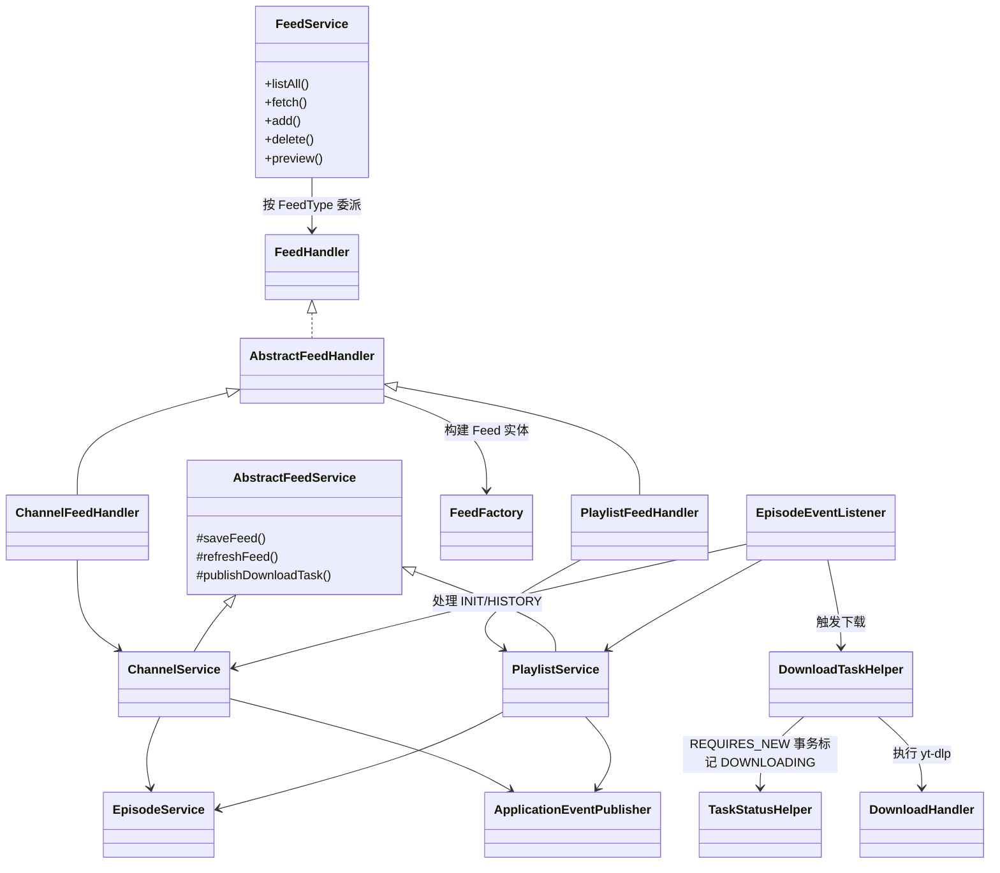

# PigeonPod 架构设计

## 1. 项目背景与目标

- **定位**：自托管的 YouTube→播客 桥梁，将频道或播放列表转换成带可下载音/视频附件的 RSS Feed，任意播客客户端均可订阅。
- **核心目标**：保持单节点部署可控、自动完成抓取与下载、提供完整的多语言体验，并让独立维护者或 AI 协作者可以在不反复摸索代码的情况下持续演进。

## 2. 功能与特性

- 一键订阅频道/播放列表：`FeedService.fetch` + 前端预览 Modal，配合 `EditFeedModal` 配置关键词/时长过滤、节目上限、音/视频预设、自定义标题/封面。
- 简化的订阅流程：频道固定抓取 50 个节目（1 页），播放列表抓取全部节目并全部入库；`initialEpisodes` 仅控制首次自动下载数量（默认 10 个），其余节目保存为 `READY` 状态（仅元数据），用户可在 Feed 详情页按需手动下载。
- 计划任务驱动的增量同步：`ChannelSyncer`/`PlaylistSyncer` 定期刷新订阅，自动抓取新节目并根据 `initialEpisodes` 触发自动下载；历史节目通过 Feed 详情页的"获取历史节目"按钮手动触发。
- yt-dlp 音/视频下载：按 Feed 保存音频质量 (0–10)、视频清晰度与编码，生成规范化路径，支持封面上传/缓存/清理。
- 全局播放器：基于 Plyr 与 React-Plyr 实现，音频在底部播放栏播放，视频在居中模态窗口播放；支持在 Feed 详情页直接播放已下载的音视频内容，未下载的节目跳转到 YouTube。
- Rome + iTunes 模块生成频道和播放列表 RSS，配合 API Key 访问控制；Enclosure 映射 `/media/{episodeId}.{ext}`。
- 账户面板可更改用户名/密码，生成 API Key，保存 YouTube API Key（`YoutubeApiKeyHolder` 缓存），以及上传/删除会员内容 Cookies。
- 完整的国际化链路（Spring `MessageSource` + i18next），Mantine UI 支持下载状态轮询与复制回退体验。
- 运营工具：`DownloadScheduler` 保持线程池忙碌、`EpisodeCleaner` 控制 `maximumEpisodes`、`StaleTaskCleaner` 启动时修复卡死任务、`VersionUpdateAlert` 提示上游版本。

## 3. 技术栈

| 层级 | 技术 |
| --- | --- |
| 后端 | Java 17、Spring Boot 3.5（Web/Scheduling/Async/Retry）、MyBatis-Plus、SQLite（WAL）、Flyway、Sa-Token（登录 + API Key）、Rome+iTunes 模块、YouTube Data API v3、yt-dlp |
| 前端 | React 19、Vite 7、Mantine 8、Mantine DataTable、React Router v6、Mantine Notifications、i18next、Axios、Tabler Icons、Plyr、React-Plyr |
| 基础设施 | Maven、Node.js、Docker Compose、GitHub Releases（版本检查）、本地文件系统 `data/audio` & `data/cover` |

## 4. 代码仓库结构

- `backend/`：Spring Boot 项目  
  - `controller`：`AuthController`、`AccountController`、`FeedController`、`EpisodeController`、`MediaController`、`RssController`、`SpaErrorController`。  
  - `service`：核心领域服务（`FeedService`、`ChannelService`、`PlaylistService`、`EpisodeService`、`MediaService`、`AccountService`、`AuthService`、`CookiesService`、`RssService`、`FeedFactory`、`FeedHandler`）。  
  - `handler`：`ChannelFeedHandler`、`PlaylistFeedHandler`、`DownloadHandler`、`AbstractFeedHandler`、`FeedEpisodeHelper`。  
  - `helper`：YouTube 解析 (`YoutubeHelper`、`YoutubeChannelHelper`、`YoutubePlaylistHelper`、`YoutubeVideoHelper`) 及下载队列工具 (`DownloadTaskHelper`、`TaskStatusHelper`)。  
  - `scheduler`：`ChannelSyncer`、`PlaylistSyncer`、`DownloadScheduler`、`EpisodeCleaner`、`StaleTaskCleaner`。  
  - `event` / `listener`：`DownloadTaskEvent`、`EpisodesCreatedEvent`、`EpisodeEventListener`。  
  - `config`：异步线程池、Locale Resolver、MyBatis-Plus、Sa-Token 适配器、`YoutubeApiKeyHolder` 等。  
  - `mapper`：Channel/Episode/Playlist/PlaylistEpisode/User 的 MyBatis-Plus 映射。  
  - `model`：实体、枚举、响应 DTO、常量。  
  - `resources/db/migration`：Flyway V1…V16 + Repeatable 脚本记录 SQLite schema 演化。
- `frontend/`：Vite + React 应用  
  - `src/components`：Header、Layout、LoginForm、VersionUpdateAlert、EditFeedModal、CopyModal、GlobalPlayer。  
  - `src/pages`：`Home`、`Feed`、`UserSetting`、`Forbidden`、`NotFound`。  
  - `src/context/User`：User Context、Reducer、Provider。  
  - `src/context/Player`：PlayerContext、PlayerProvider，管理全局播放器状态（当前节目、播放/暂停、最大化/最小化等）。  
  - `src/helpers`：Axios 单例、history 包装、自定义工具与通知。  
  - 其余 `constants/locales/theme/assets` 等资源；`vite.config.js` 负责开发态 `/api` `/media` 代理。
- `documents/`：多语言文档（架构、音频/视频参数指南、接入教程等）。  
- `data/`：默认音频/封面目录（本地或 Docker volume 挂载）。  
- `release/`：打包辅助资产（Logo、脚本）。  
- 根目录包含 `Dockerfile`、`README.md` 等通用文件。

## 5. 系统架构概览

1. **Controller 层**：暴露 `/api/**` 与 `/media/**`。`@SaCheckLogin` 保护 feed/episode/account 操作，`@SaCheckApiKey` 守护 RSS，`SpaErrorController` 将 GET `/error` 前转到前端入口以支持 SPA 路由。
2. **领域服务与工厂**：`FeedService` 解析 `FeedType` 并委派给已注册的 `FeedHandler`；`ChannelService`、`PlaylistService` 继承 `AbstractFeedService`，复用保存/更新/刷新模板并负责发布 `DownloadTaskEvent`。`EpisodeService`、`MediaService`、`AccountService`、`AuthService`、`CookiesService` 处理各自子域。
3. **Handler / Helper**：  
   - `ChannelFeedHandler`、`PlaylistFeedHandler` 继承 `AbstractFeedHandler`，通过 `FeedFactory` 构造实体，再调用业务服务。  
   - `DownloadHandler` 封装 yt-dlp 调用、临时 Cookies、嵌入元数据、重试与日志。  
   - `YoutubeHelper` 系列负责解析 ID、分页抓取并封装 Episode。  
   - `DownloadTaskHelper` + `TaskStatusHelper` 将提交与状态迁移拆开，先在 `REQUIRES_NEW` 事务中将 PENDING/FAILED → DOWNLOADING，再投递到 `downloadTaskExecutor`。
4. **事件、调度与异步基础设施**：  
   - `EpisodesCreatedEvent` 在 Episode 落库后触发；`DownloadTaskEvent` 表示频道/播放列表的 INIT/HISTORY 指令。  
   - `EpisodeEventListener` 监听 `AFTER_COMMIT`，负责把 Episode 加入下载队列，以及在 `@Async` 线程中调用 `processChannelInitializationAsync`/`processPlaylistDownloadHistoryAsync` 等长任务。  
   - `AsyncConfig` 定义 `downloadTaskExecutor`（3 线程、无队列）与 `channelSyncTaskExecutor`（2 线程 + 小队列）。  
   - `ChannelSyncer`/`PlaylistSyncer` 每小时扫描 `lastSyncTimestamp`，`DownloadScheduler` 每 30 秒补充线程池，`EpisodeCleaner` 每 2 小时按 `maximumEpisodes` 清理，`StaleTaskCleaner` 启动时把遗留的 DOWNLOADING 转回 PENDING。
5. **持久化层**：MyBatis-Plus 处理常规 CRUD，复杂 SQL（如 `EpisodeMapper.deleteEpisodesOverChannelMaximum` 的窗口函数）放在注解语句中。Flyway 保障 SQLite schema 可复现。
6. **前端 SPA**：在 `src/main.jsx` 中初始化 i18n → `UserProvider` → `BrowserRouter` → `MantineProvider` + `Notifications`。`Home` 负责订阅入口，`Feed` 展示节目列表（懒加载 + 状态轮询），`UserSetting` 管理账号，公共组件复用头部/认证/版本提示逻辑。

### Service 层关系图

## 6. 数据模型

- **Feed 抽象**：`id`、YouTube `source`、默认/自定义标题与封面（`customTitle`、`customCoverExt`、衍生出的 `customCoverUrl`）、标题/描述关键词过滤、`minimumDuration`、`maximumDuration`、`initialEpisodes`、`maximumEpisodes`、下载选项（`DownloadType`、`audioQuality`、`videoQuality`、`videoEncoding`）、同步标记（`lastSyncVideoId`、`lastSyncTimestamp`）、时间戳（`subscribedAt`、`lastUpdatedAt`）。
- **Channel / Playlist**：Channel 含 `handler`（@handle 搜索），Playlist 含 `ownerId` 与 `episodeSort`。二者共用 Feed 配置并在 Service 层扩展特定逻辑。
- **Episode**：主键即视频 ID，存储 `channelId`、标题描述、发布时间、默认/高清封面、ISO 8601 `duration`、`downloadStatus`（`READY`/`PENDING`/`DOWNLOADING`/`COMPLETED`/`FAILED`，其中 `READY` 表示仅保存元数据、尚未排队下载）、`mediaFilePath`、`mediaType`、`errorLog`、`retryNumber`、`createdAt`。
- **PlaylistEpisode**：播放列表与 Episode 的映射表，保存 `id`、`playlistId`、`episodeId`、`coverUrl`、`publishedAt`，实现“同一 Episode 在多播放列表复用”的需求。
- **User**：`id`、`username`、盐化密码、`apiKey`、`youtubeApiKey`、`cookiesContent`、时间戳及临时字段（`newPassword`、`token`）。ID 为 0 的系统用户专门存储 API Key 与 Cookies。

## 7. 核心流程

1. **订阅创建**  
   - `FeedController.fetch` 调用 `FeedService.fetch`，先用简单规则判断类型，随后由 `ChannelFeedHandler`/`PlaylistFeedHandler` 调用 YouTube Helper 拉取频道信息 + 最近 5 个节目用于预览。  
   - 用户确认后 `FeedController.add` 进入 `FeedService.add → FeedHandler.add → ChannelService/PlaylistService.saveFeed`。`AbstractFeedService` 归一化 `initialEpisodes`（默认 10）：频道固定抓取 1 页（50 个节目），播放列表抓取全部节目，所有节目均入库。前 `initialEpisodes` 个节目标记为 `PENDING` 状态并触发下载，其余节目标记为 `READY` 状态（仅保存元数据）。`DownloadTaskEvent(INIT)` 交给后台异步处理完整的初始化流程。
2. **增量同步**  
   - `ChannelSyncer`/`PlaylistSyncer` 每小时调用 `findDueForSync(now)`，根据 `lastSyncTimestamp` 或播放列表排序规则挑出需更新的 Feed，然后 `refreshChannel/refreshPlaylist` 会从 YouTube 拉取新视频直到遇到 `lastSyncVideoId`，持久化、更新标记并触发 `EpisodesCreatedEvent`。新增的节目根据 `initialEpisodes` 设置，前 N 个自动下载（`PENDING`），其余保存为 `READY` 状态。  
   - 历史节目获取：用户可在 Feed 详情页点击"获取历史节目"按钮（调用 `/api/feed/{type}/history/{feedId}`），触发 `ChannelService.fetchHistoryEpisodes` 或 `PlaylistService.fetchHistoryEpisodes`，从数据库最早节目的发布时间往前抓取更多历史节目，全部保存为 `READY` 状态，用户可按需手动下载。
3. **下载流水线**  
   - `EpisodeEventListener.handleEpisodesCreated` 在事务提交后拿到 Episode ID，逐个调用 `DownloadTaskHelper.submitDownloadTask`。Helper 在 `TaskStatusHelper` 的 `REQUIRES_NEW` 事务内把 PENDING/FAILED 标成 DOWNLOADING，再把任务丢进 `downloadTaskExecutor`。  
   - `DownloadHandler.download` 确定所属 feed 以决定目录与下载选项，必要时通过 `CookiesService` 生成临时 cookie 文件，拼接 yt-dlp 命令（音频/视频模式、质量、编码），清洗路径名、嵌入元数据、收集日志，并回写 `mediaFilePath`、`mediaType`、`errorLog`、`retryNumber`。临时 cookie 会在 `finally` 删除。  
   - `DownloadScheduler` 负责填满线程池：优先取最早的 PENDING 记录，不足时补 `retryNumber < 3` 的 FAILED。若线程池拒绝执行则立即把状态回滚到 PENDING。`StaleTaskCleaner` 在应用启动时把遗留的 DOWNLOADING 复位。  
   - 手动下载：UI 允许对 `READY` 状态的节目进行手动下载，`EpisodeController.downloadEpisode` 调用 `EpisodeService.manualDownloadEpisode`，将状态更新为 `PENDING` 并发布 `EpisodesCreatedEvent`，后续流程与自动下载相同。对失败节目可进行"重新下载"（`retryEpisode`），对排队中的节目可进行"取消"（`cancelEpisode`，状态重置为 `READY`）。  
   - `EpisodeCleaner` 每 2 小时运行一次：先通过 SQL 分组统计找出 COMPLETED 状态节目数量超过 `maximumEpisodes` 的频道和播放列表，再仅对这些订阅查询需要清理的旧节目，对其删除本地媒体/字幕文件，并将 `download_status` 重置为 `READY`，保留数据库中的 Episode 记录，从而既控制磁盘占用又保留节目元数据。
4. **RSS / 媒体分发**  
   - `RssController` 提供 `/api/rss/{channelIdentification}.xml` 和 `/api/rss/playlist/{playlistId}.xml`，依赖 `SaApiKeyDataLoaderImpl` 校验 API Key。`RssService` 使用 Rome + iTunes Metadata 构造 feed，并用 `pigeon.base-url` 拼接 enclosure。  
   - `MediaController` 暴露 `/media/feed/{feedId}/cover`（自定义封面）与 `/media/{episodeId}.{ext}`（音/视频流）。`MediaService` 校验 MIME、确保文件在配置目录内，并设置合理的响应头。

## 8. 前后端协作

- `frontend/src/helpers/api.js` 统一管理 Axios，请求拦截器附带 `Accept-Language`（来自 i18next），响应拦截器把错误交给 `showError`。401 会触发登出与重定向，保持 Sa-Token 与 localStorage 同步。
- `UserContext` + `UserProvider` 在应用最外层包裹，初始化时从 `localStorage` 里 hydrate，Reducer 仅暴露 `login`/`logout`。`PlayerContext` + `PlayerProvider` 管理全局播放器状态（`currentEpisode`、`feedTitle`、`isPlaying`、`isMaximized` 等）并提供 `play`、`pause`、`close`、`toggleMaximize` 等方法。`main.jsx` 挂载 `Notifications` 与 `GlobalPlayer`，供全局 toast 和播放器使用。
- `GlobalPlayer` 组件基于 Plyr 实现：音频在底部固定播放栏显示（带封面、标题、Plyr 控制器），视频自动在居中模态窗口播放；两者均支持进度条、音量、播放速度等完整控制。点击关闭按钮可停止播放。
- `Home` 页面 (`pages/Home/index.jsx`) 调 `/api/feed/list` 渲染卡片，完成订阅流程：`fetchFeed` 走 `/api/feed/fetch` 并弹出预览 Modal，`addFeed` 调 `/api/feed/{type}/add`，`EditFeedModal` 在每次修改时可以触发实时预览。顶部的 `VersionUpdateAlert` 每 30 分钟（`update_check` 本地节流）访问 GitHub Releases 保存提示信息。
- `Feed` 页面 (`pages/Feed/index.jsx`) 调 `/api/feed/{type}/detail/{id}` 与分页 `/api/episode/list/{feedId}`（频道直接查 Episode，播放列表使用 `PlaylistEpisodeMapper`）。实现了 `IntersectionObserver` 懒加载、下载状态彩色徽章、受 API Key 保护的 RSS 复制（`/api/feed/{type}/subscribe/{id}`）、自定义标题/封面 Modal（`/api/feed/{type}/{id}/cover` + `PUT /api/feed/{type}/config/{id}`）、删除订阅、手动下载/重试/取消节目（`/api/episode/download/{id}`、`/api/episode/retry/{id}`、`/api/episode/cancel/{id}`）、获取历史节目（`/api/feed/{type}/history/{id}`）、直接播放已下载节目等功能。节目卡片封面带有播放按钮覆盖层，点击后调用 `PlayerContext.play()` 触发全局播放器；未下载的节目点击播放会跳转到 YouTube。活跃任务每 3 秒 POST `/api/episode/status`，只更新状态/错误字段，避免打乱分页。
- `UserSetting` 通过 `AccountController` 调用实现用户名修改、密码重置（`/api/account/reset-password`）、API Key 生成（并刷新 localStorage）、YouTube API Key 保存（刷新 `YoutubeApiKeyHolder`）、Cookies 上传/删除（前端读取文本 -> JSON；后端按明文存储并仅在下载时生成临时文件）。
- `Header` 提供语言切换（写入 localStorage + i18next）、Mantine 颜色模式切换、GitHub 链接以及用户菜单（账户设置/退出）。`LoginForm` 自带校验，识别 `?expired=true` 时展示令牌过期提醒。
- `CopyModal` 在 Clipboard API 不可用时提供手动复制提示，`helpers/utils.js` 集中管理 ISO 时长/日期格式化与通知配色。

## 9. 国际化

- 后端：`LocaleConfig` 注册 `HeaderLocaleResolver`，所有请求的 `Accept-Language` 决定 `LocaleContextHolder`。Service/Handler 抛出的 `BusinessException` 使用 message key，`SaResult` 返回本地化信息；`RssService`、`DownloadHandler` 等也共享同一 `MessageSource`。
- 前端：`src/i18n.js` 预加载 8 份 JSON 语言包并把选择写入 `language`；组件通过 `useTranslation` 读取，`Header` 提供切换入口。Axios 带上相同的语言头，保证提示文案一致。

## 10. 错误处理与可靠性

- 统一通过 `BusinessException` 向前端返回 `{ code, msg, data }`，同时在服务端打出堆栈。  
- `TaskStatusHelper` 在独立事务中完成状态迁移并启用 Spring Retry，抵御 SQLite 锁冲突；`DownloadHandler.updateEpisodeWithRetry` 同样使用重试保证状态落库。`DownloadScheduler` 因为线程池无队列，因此拒绝时会立即把状态回滚，避免“假下载”。  
- `EpisodeService.deleteEpisodeById`/`retryEpisode` 负责清理文件并复用 `EpisodesCreatedEvent`，无需修改下游流程。`StaleTaskCleaner` 与 `EpisodeCleaner` 分别负责启动补偿和长期资源治理。  
- 前端 `showError` 针对 401/429/500 做专门文案，其余走本地化兜底；活跃任务轮询仅更新必要字段，减小重渲染成本。  
- `MediaService`、`CookiesService` 均校验路径并在 finally 清理临时文件，避免任意文件暴露或敏感信息遗留。

## 11. 安全

- Sa-Token 处理会话与 `@SaCheckLogin`，`AuthController` 退出登录时同步清理；RSS 接口用 `@SaCheckApiKey` + `SaApiKeyDataLoaderImpl` 读取 `user.api_key`，可随时轮换。密码通过 `PasswordUtil` 盐化存储。
- 当前仅存在系统用户，账号接口都会校验 `id` 与登录主体一致。Cookies 虽保存在 SQLite，但仅在下载时写入 audio 目录下的 `temp/`，完成后立即删除。上传接口受 `spring.servlet.multipart` 限制并校验 MIME。
- `MediaService` 限定文件必须位于 `pigeon.audio-file-path` / `pigeon.cover-file-path` 下，`DownloadHandler` 对目录/文件名做 sanitize，防止命令注入与路径穿越。
- `YoutubeApiKeyHolder` 用 `AtomicReference` 缓存 API Key，并在 `AccountService` 更新时刷新，减少 DB 读取；`SpaErrorController` 只允许 GET fallback，其他请求仍返回标准响应。

## 12. 配置与部署

- `backend/src/main/resources/application.yml` 提供默认值：端口 8080、优雅停机、SQLite JDBC（WAL/缓存/忙等待）、Hikari 配置、Flyway、上传大小、日志级别、Sa-Token 行为。`pigeon.base-url`、`pigeon.audio-file-path`、`pigeon.cover-file-path` 需按环境覆盖（Docker Compose 映射 `/data`）。  
- `AsyncConfig` 中下载线程池固定 3 个线程，Feed 异步线程池 2 个线程 + 小队列；若要调整需同时评估 SQLite WAL 设置。  
- 服务器需预装 yt-dlp；`CookiesService` 会在音频目录下建 `temp/` 存放临时 cookie。前端开发默认访问 `http://localhost:8080`，`vite.config.js` 代理 `/api` 与 `/media`。  
- Docker 部署可直接使用仓库内 `Dockerfile` / `docker-compose.yml` 示例（8080→8834、挂载 `/data`、设置 BASE_URL/音频/封面路径、覆盖 JDBC）。独立 JAR 运行可用 `-D` 传递同样的配置。  
- 前端通过 `npm run build` 产出 `frontend/dist`；发布版提供可执行 JAR 和静态资源。`VersionUpdateAlert` 轮询 `https://api.github.com/repos/aizhimou/pigeon-pod/releases/latest`（客户端 30 分钟节流）提醒管理员。

## 13. 扩展与协作建议

- **订阅类型**：新增来源时实现新的 `FeedHandler` + `AbstractFeedService` 子类，注册到 `FeedFactory` 后即可复用现有保存/下载/回溯能力；按需扩展 YouTube Helper 或接入其他平台。  
- **下载策略**：新的参数（如字幕、容器格式）放入 Feed 实体，在 `EditFeedModal` 暴露、由 `FeedController` 保存，`DownloadHandler` 中读取。队列控制仍复用 `DownloadTaskHelper`。  
- **调度/监控**：遵循现有 `@Scheduled` + 日志的模式新增清理或健康检查；若需要对外可视化，可接入 Spring Actuator 或自定义 `/api` 指标端点。  
- **前端模式**：继续复用 Mantine Modal/Form（`EditFeedModal` 是模板），所有接口通过 `helpers/api`，文案统一走 i18next。新增路由时放在 `Layout` 下，保持 Header/Toast/上下文常驻。  
- **文档协同**：重要架构改动务必同步更新 `documents/`（本文件即范例），必要时补充 ADR，方便后续开发者或 AI 伙伴快速了解背景。
