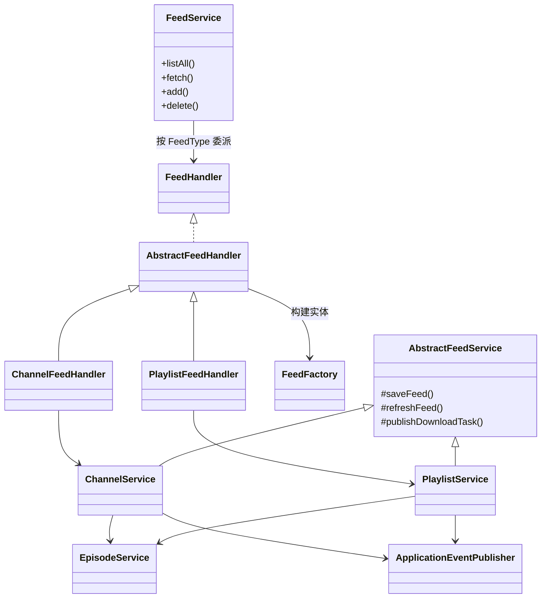

# PigeonPod 架构设计

## 1. 项目背景与目标

- **定位**：自托管播客化工具，把 YouTube 频道或播放列表转换成可在任何播客客户端订阅、播放和下载的 RSS Feed。
- **核心目标**：简化个人部署、自动化抓取与下载、保持多语言友好体验，同时确保架构清晰，便于独立开发者和 AI 协作快速扩展。

## 2. 功能与特性

- 一键订阅频道/播放列表，支持预览与配置过滤条件。
- 自动增量同步节目，支持历史回溯与异步批量下载。
- 音频/视频下载可选质量、编码，支持自定义封面与标题。
- 生成带 iTunes 扩展的 RSS，API Key 保护，外部播客客户端可直接订阅。
- 用户账号管理（登录、密码、用户名、API Key、YouTube API Key、Cookies）。
- 全链路多语言（后端消息 + 前端 UI）。
- 运营辅助：下载任务调度、失败重试、版本升级提醒。

## 3. 技术栈

| 层级 | 技术 |
| --- | --- |
| 后端 | Java 17, Spring Boot 3.5 (Web, Scheduling, Async, Retry, Cache), MyBatis-Plus, SQLite, Flyway, Sa-Token, Rome RSS, YouTube Data API v3, yt-dlp |
| 前端 | React 19, Vite 7, Mantine 8, React Router, Axios, i18next, Mantine Notifications |
| 基础设施 | Maven, Node.js, Docker Compose, 本地文件系统 (音频/封面) |

## 4. 系统架构概览

1. **Controller 层**：暴露 `/api/**` 和 `/media/**`，处理参数、鉴权注解、响应包装。
2. **Service 层**：`FeedService` 注册并委派到频道/播放列表 handler；`ChannelService`、`PlaylistService` 继承 `AbstractFeedService` 完成订阅生命周期；`EpisodeService`、`MediaService`、`AccountService` 等完成领域逻辑。设计模式：`FeedService` 作为门面统一对外入口；`FeedHandler` 及其具体实现按 `FeedType` 套用策略模式；`AbstractFeedService` 则提供模板方法骨架，子类只需补齐持久化与内容抓取细节即可复用保存/更新/刷新流程。
3. **事件与调度**：Spring 事件 (`EpisodesCreatedEvent`, `DownloadTaskEvent`) + `ChannelSyncer`/`PlaylistSyncer` + `DownloadScheduler` 形成“发现 → 下载 → 分发”的流水线。
4. **持久化**：MyBatis-Plus Mapper 对接 SQLite；Flyway 管理 schema。
5. **前端应用**：React SPA，通过 Axios 访问后端，Mantine 负责 UI，UserContext 管理登录态，i18next 负责多语言。

### Service 层关系图

## 5. 数据模型

- **Feed 抽象**：包含 ID、标题/自定义标题、封面/自定义封面、来源类型、关键词/时长过滤、初始/最大节目数、下载类型与音/视频质量、最后同步标记。
- **Channel / Playlist**：继承 Feed，增加 handler、ownerId、排序方式等字段。
- **Episode**：节目 ID、所属频道、标题描述、发布时间、封面、ISO 8601 时长、下载状态、媒体路径、MIME、错误日志、重试次数、创建时间。
- **User**：用户名、密码/盐、API Key、YouTube API Key、Cookies、时间戳。

## 6. 核心流程

1. **订阅创建**  
   - 输入源地址 → `FeedService.fetch` 猜类型并调用 YouTube API 获取 Feed + 最近节目。  
   - 用户确认后 `FeedService.add` → `AbstractFeedService.saveFeed` 根据初始抓取量决定同步（即时抓取 + 发布下载事件）或异步（发布 DownloadTaskEvent 由后台批量处理）。

2. **增量同步**  
   - `ChannelSyncer` / `PlaylistSyncer` 定时扫描 `lastSyncTimestamp` 过期的 Feed，调用 `refreshFeed` 获取新节目，更新同步标记并发布下载事件。

3. **下载流水线**  
   - `EpisodesCreatedEvent` → `EpisodeEventListener` → `DownloadTaskSubmitter` (REQUIRES_NEW 事务标记状态) → 线程池执行 `DownloadWorker`。  
   - `DownloadWorker` 构造 yt-dlp 命令（含音/视频配置、Cookies 文件），下载成功写媒体路径/MIME/状态，失败记录 errorLog 并增加重试次数。  
   - `DownloadScheduler` 每 30 秒根据线程池剩余槽位挑选 PENDING / FAILED(<3) 任务补充执行。

4. **RSS 生成与媒体分发**  
   - `/api/rss/...` 根据 API Key 读取频道/播放列表与对应节目，使用 Rome + iTunes 模块生成 RSS，Enclosure 指向 `/media/{episodeId}.{ext}`。  
   - `/media/...` 校验文件路径合法性后返回流式响应，支持 mp3/mp4/m4a 等。

## 7. 前后端协作

- Axios 实例统一设置 `baseURL` 与 `Accept-Language`，401 自动跳转登录并清理缓存用户。
- React Router 管理页面，UserContext 结合 localStorage 实现持久化登录。
- Mantine UI + Hooks（如 `useDisclosure`、`useMediaQuery`）驱动交互；公共组件（Header、EditFeedModal、CopyModal、VersionUpdateAlert）复用常见逻辑。
- 所有表单/操作通过 `showSuccess` / `showError` 等统一通知交互反馈。

## 8. 国际化策略

- **后端**：Spring `MessageSource` + 多语言 properties；自定义 `LocaleResolver` 基于请求头决定语言；抛出 `BusinessException` 时使用 message key，以 Sa-Token 响应格式返回。
- **前端**：i18next 初始化多语言资源，语言切换写入 localStorage；UI 通过 `useTranslation` 渲染；Axios 请求同步语言头部，确保前后端提示一致。

## 9. 错误处理与可靠性

- 后端统一使用 `BusinessException` + 全局异常处理器，系统异常返回标准 HTTP 状态码；下载/文件操作处详细日志与兜底。
- 下载任务采用事务 + 重试（Spring Retry），并在失败后回滚状态避免“假下载”。
- 前端 `showError` 根据 HTTP 状态分类提示（401/429/500 等），其余情况通用错误提示。
- 定时任务、事件监听均包裹 try/catch，单个订阅失败不会影响整体流程。

## 10. 安全策略

- Sa-Token 管理登录会话与注解鉴权，RSS 接口通过 API Key 保护。  
- 媒体访问仅允许配置目录内文件；封面上传校验 MIME/大小；Cookies 文件以临时目录保存并在下载后删除。  
- 配置项 `pigeon.base-url`、`audio-file-path`、`cover-file-path` 需部署时提供安全路径，避免暴露敏感目录。

## 11. 配置与部署要点

- `application.yml` 提供默认端口、SQLite 连接、Flyway、上传限制、日志级别等，可通过环境变量覆盖。  
- 部署需预装 yt-dlp，并保证音频/封面目录可写。  
- 推荐 Docker Compose：映射 8080 端口、挂载数据卷、设置 BASE_URL/文件路径、覆盖 JDBC URL。  
- 日志级别开发期可设 debug，生产建议 info，并结合外部日志系统。

## 12. 扩展与协作建议

- 新增 Feed 类型：实现 `FeedHandler` + `AbstractFeedService` 子类并注册 `FeedFactory`，即可复用既有流程。
- 下载策略扩展：在 Feed 配置中添加新的音/视频参数，`DownloadWorker` 通过统一上下文读取。
- 监控：可补充 Actuator、下载任务仪表盘或简单健康检查接口。
- 文档：本文件作为架构入口，建议在 `documents/` 内记录新的模块设计或 ADR，便于长期维护。
- AI 协作：指引 AI 先阅读此文档，再给出具体模块/文件路径，即可高效参与实现或改造。
