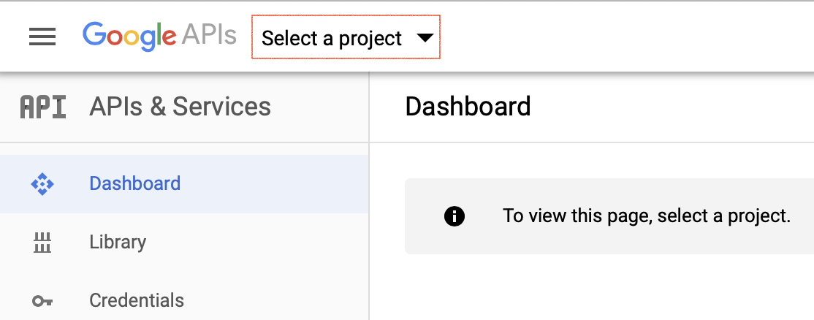
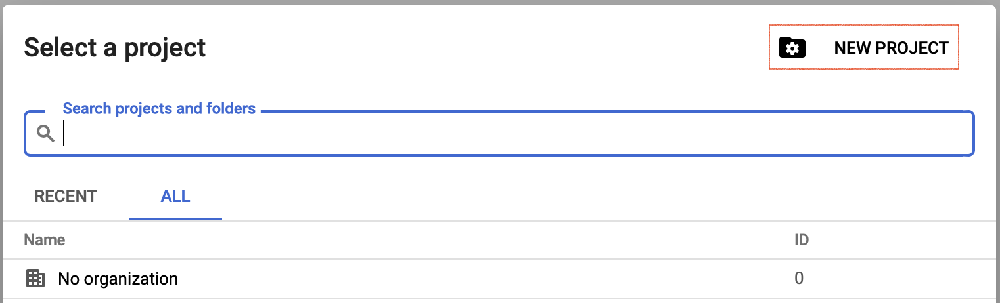
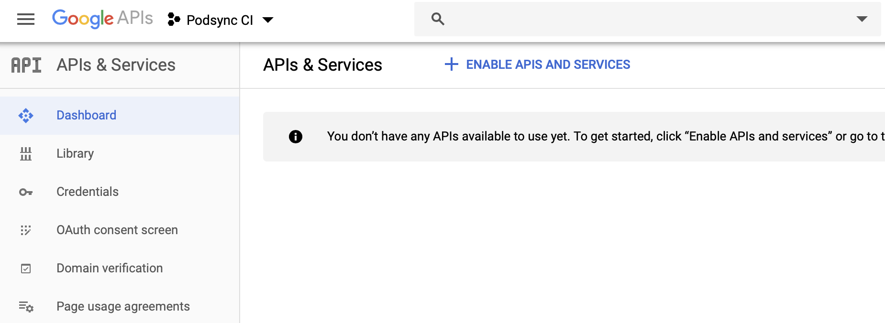
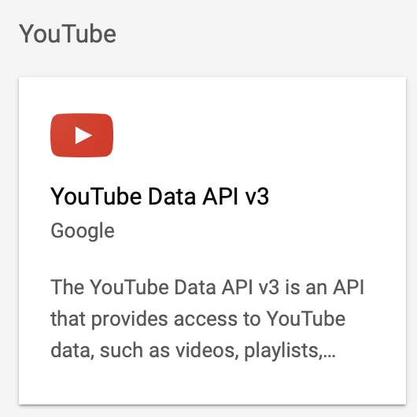
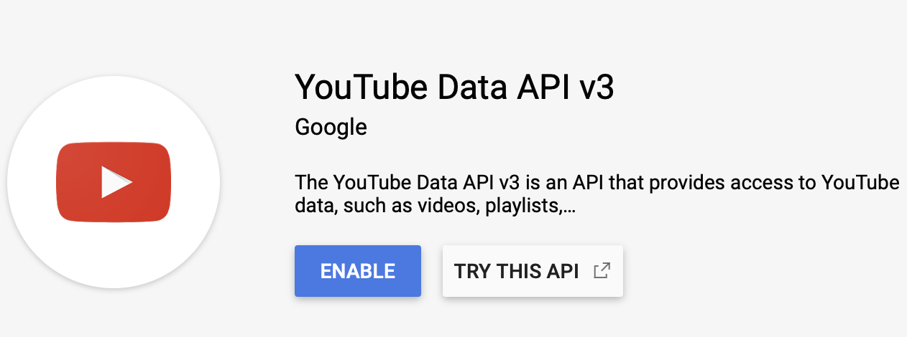
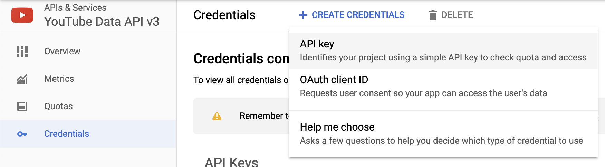
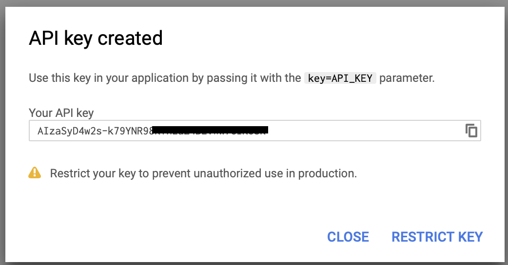
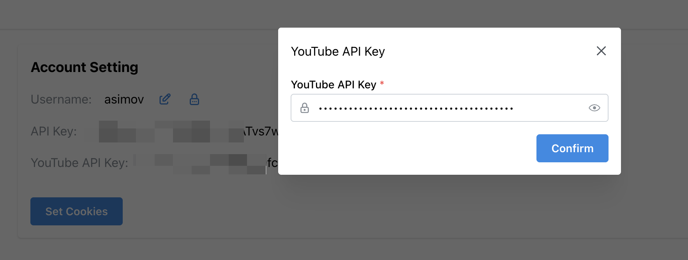

# How to get YouTube API Key

1. Navigate to https://console.developers.google.com

2. Click `Select a project`.

3. Click `New project`.

4. Give it a name and click `Create` button.

5. Click `Library`, find and click on `YouTube Data API v3` box.

6. Click `Enable`.

5. Click `Credentials`.

6. Click `Create credentials`.

7. Select `API key`.

8. Copy token.

9. Set api key in pigeonpod.
