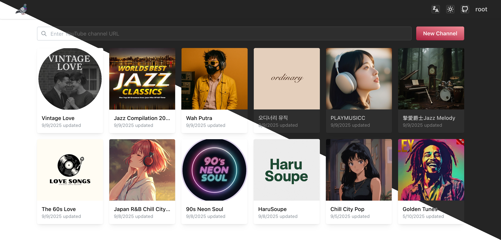
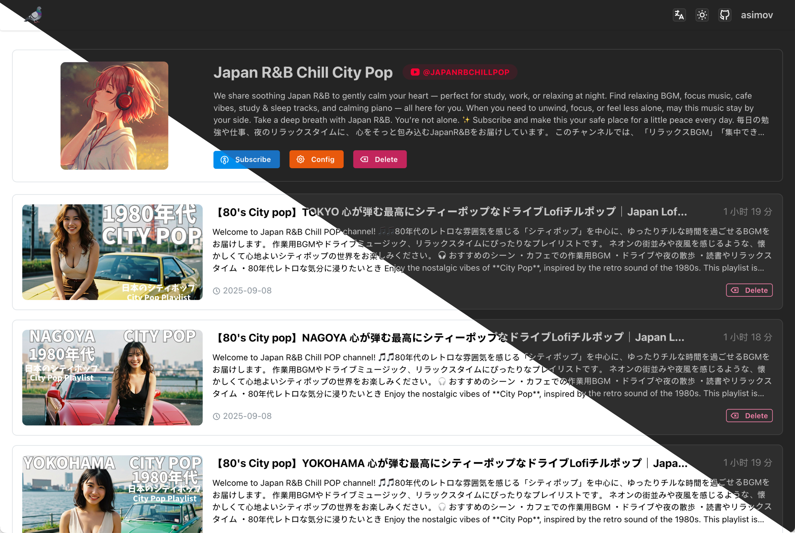

<div align="center">
  
  <h1>PigeonPod</h1>
  <h2>Transformez vos chaînes YouTube préférées en chaînes de podcast de la manière la plus simple et élégante.</h2>
  <h3>Si l'auto-hébergement n'est pas votre tasse de thé, jetez un œil à nos services en ligne à venir :
    <a target="_blank" href="https://pigeonpod.cloud/">PigeonPod</a>
  </h3>
</div>

<div align="center">
  
[](../../README.md) [](README-ZH.md) [](README-ES.md) [](README-PT.md) [](README-JA.md) [](README-DE.md) [](README-KO.md)
</div>

## Captures d'écran


<div align="center">
  <p style="color: gray">Liste des chaînes</p>
</div>


<div align="center">
  <p style="color: gray">Détails de la chaîne</p>
</div>

## Fonctionnalités principales

- **🎯 Abonnement intelligent** : Ajoutez et synchronisez en un clic des chaînes ou playlists YouTube.
- **🤖 Synchronisation automatique** : Vérification et synchronisation automatiques du contenu le plus récent avec des mises à jour incrémentales.
- **📻 Abonnement RSS pour podcasts** : Génération de liens d'abonnement RSS standard, compatibles avec n'importe quel client de podcast.
- **🔍 Filtrage de contenu** : Prise en charge du filtrage par mots-clés dans le titre et la description (inclure/exclure), ainsi que par durée d'épisode.
- **📊 Gestion des épisodes** : Visualisez, supprimez et relancez les téléchargements d'épisodes échoués.
- **🎦 Prise en charge vidéo** : Téléchargez des épisodes vidéo avec choix de résolution et de codage ; lecture dans les clients podcast compatibles vidéo.
- **🎚 Réglage de la qualité audio** : Choisissez un niveau 0–10 ou conservez la piste d'origine pour concilier qualité et taille.
- **💽 Chapitres et métadonnées** : Écrit automatiquement les métadonnées et les marqueurs de chapitres dans les fichiers pour améliorer l'expérience d'écoute.
- **✨ Écoute sans publicité** : Suppression automatique des publicités d'introduction et intermédiaires des épisodes.
- **🍪 Cookies personnalisés** : Support des abonnements au contenu à restriction d'âge et au contenu premium via le téléchargement de cookies.
- **🌐 Support multilingue** : Support complet des interfaces en anglais, chinois, espagnol, portugais, japonais, français, allemand et coréen.
- **📱 Interface responsive** : Excellente expérience sur n'importe quel appareil, à tout moment, n'importe où.

## Déploiement

### Utilisation de Docker Compose (Recommandé)

**Assurez-vous d'avoir Docker et Docker Compose installés sur votre machine.**

1. Utilisez le fichier de configuration docker-compose, modifiez les variables d'environnement selon vos besoins :
```yml
version: '3.9'
services:
  pigeon-pod:
    image: 'ghcr.io/aizhimou/pigeon-pod:latest' 
    restart: unless-stopped
    container_name: pigeon-pod
    ports:
      - '8834:8080'
    environment:
      - 'PIGEON_BASE_URL=https://pigeonpod.cloud' # définissez votre domaine
      - 'PIGEON_AUDIO_FILE_PATH=/data/audio/' # définissez le chemin de vos fichiers audio
      - 'PIGEON_COVER_FILE_PATH=/data/cover/' # définir le chemin de votre fichier de couverture
      - 'SPRING_DATASOURCE_URL=jdbc:sqlite:/data/pigeon-pod.db' # définissez le chemin de votre base de données
    volumes:
      - data:/data

volumes:
  data:
```

2. Démarrez le service :
```bash
docker-compose up -d
```

3. Accédez à l'application :
Ouvrez votre navigateur et visitez `http://localhost:8834` avec **nom d'utilisateur par défaut : `root` et mot de passe par défaut : `Root@123`**

### Exécution avec JAR

**Assurez-vous d'avoir Java 17+ et yt-dlp installés sur votre machine.**

1. Téléchargez le JAR de la dernière version depuis [Releases](https://github.com/aizhimou/pigeon-pod/releases)

2. Créez le répertoire de données dans le même répertoire que le fichier JAR :
```bash
mkdir -p data
```

3. Exécutez l'application :
```bash
java -jar -DPIGEON_BASE_URL=http://localhost:8080 \  # définissez votre domaine
           -DPIGEON_AUDIO_FILE_PATH=/path/to/your/audio/ \  # définissez le chemin de vos fichiers audio
           -Dspring.datasource.url=jdbc:sqlite:/path/to/your/pigeon-pod.db \  # définissez le chemin de votre base de données
           pigeon-pod-x.x.x.jar
```

4. Accédez à l'application :
Ouvrez votre navigateur et visitez `http://localhost:8080` avec **nom d'utilisateur par défaut : `root` et mot de passe par défaut : `Root@123`**

## Documentation

- [Comment obtenir une clé API YouTube](../how-to-get-youtube-api-key/how-to-get-youtube-api-key-en.md)
- [Comment configurer les cookies YouTube](../youtube-cookie-setup/youtube-cookie-setup-en.md)
- [Comment obtenir l'ID de chaîne YouTube](../how-to-get-youtube-channel-id/how-to-get-youtube-channel-id-en.md)

## Stack technologique

### Backend
- **Java 17** - Langage principal
- **Spring Boot 3.5** - Framework d'application
- **MyBatis-Plus 3.5** - Framework ORM
- **Sa-Token** - Framework d'authentification
- **SQLite** - Base de données légère
- **Flyway** - Outil de migration de base de données
- **YouTube Data API v3** - Récupération de données YouTube
- **yt-dlp** - Outil de téléchargement vidéo
- **Rome** - Bibliothèque de génération RSS

### Frontend
- **Javascript (ES2024)** - Langage principal
- **React 19** - Framework d'application
- **Vite 7** - Outil de build
- **Mantine 8** - Bibliothèque de composants UI
- **i18next** - Support d'internationalisation
- **Axios** - Client HTTP

## Guide de développement

### Prérequis d'environnement
- Java 17+
- Node.js 22+
- Maven 3.9+
- SQLite
- yt-dlp

### Développement local

1. Clonez le projet :
```bash
git clone https://github.com/aizhimou/PigeonPod.git
cd PigeonPod
```

2. Configurez la base de données :
```bash
# Créez le répertoire de données
mkdir -p data/audio

# Le fichier de base de données sera créé automatiquement au premier démarrage
```

3. Configurez l'API YouTube :
   - Créez un projet dans la [Console Google Cloud](https://console.cloud.google.com/)
   - Activez l'API YouTube Data v3
   - Créez une clé API
   - Configurez la clé API dans les paramètres utilisateur

4. Démarrez le backend :
```bash
cd backend
mvn spring-boot:run
```

5. Démarrez le frontend (nouveau terminal) :
```bash
cd frontend
npm install
npm run dev
```

6. Accédez à l'application :
- Serveur de développement frontend : `http://localhost:5173`
- API backend : `http://localhost:8080`

### Notes de développement
1. Assurez-vous que yt-dlp soit installé et disponible en ligne de commande
2. Configurez correctement la clé API YouTube
3. Assurez-vous que le répertoire de stockage audio dispose d'un espace disque suffisant
4. Nettoyez régulièrement les anciens fichiers audio pour économiser l'espace

---

<div align="center">
  <p>Créé avec ❤️ pour les passionnés de podcasts !</p>
  <p>⭐ Si vous appréciez PigeonPod, donnez-nous une étoile sur GitHub !</p>
</div>
