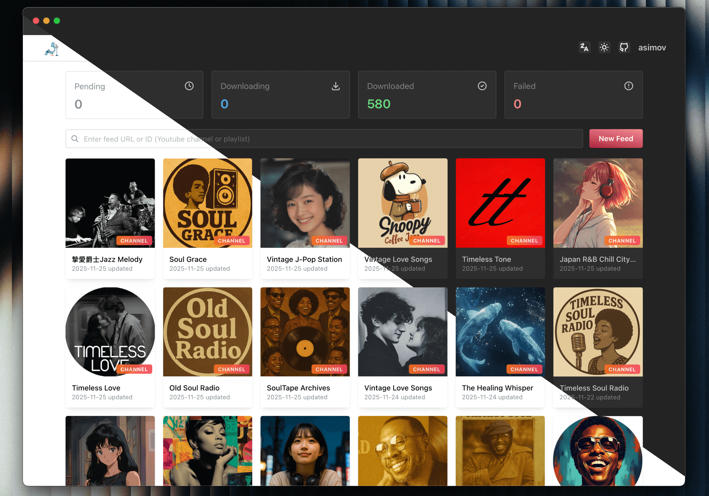
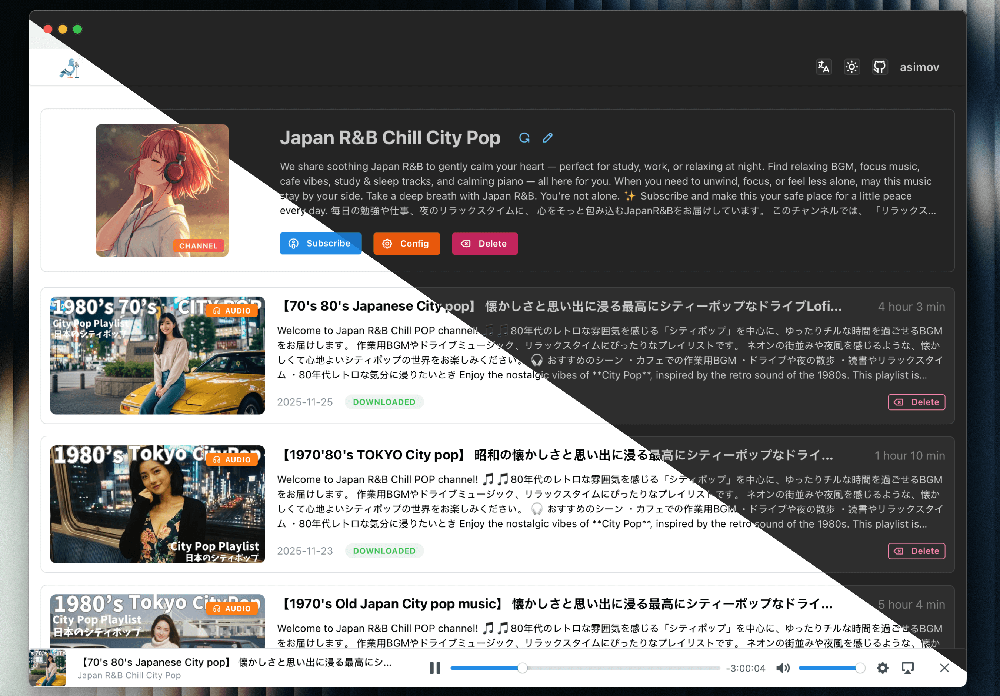

<div align="center">
  
  
  <h2>YouTube와 Bilibili를 어디서나 들으세요.</h2>
  <h3>셀프 호스팅이 부담스럽다면, 곧 출시될 온라인 서비스를 확인해보세요:
    <a target="_blank" href="https://pigeonpod.cloud/?utm_source=github&utm_medium=repo&utm_campaign=readme&utm_content=cta">PigeonPod</a>
  </h3>
</div>

<div align="center">
  
[English](../../README.md) | [简体中文](README-ZH.md) | [Español](README-ES.md) | [Português](README-PT.md) | [日本語](README-JA.md) | [Deutsch](README-DE.md) | [Français](README-FR.md)
</div>

## 스크린샷


<div align="center">
  <p style="color: gray">채널 목록</p>
</div>


<div align="center">
  <p style="color: gray">채널 상세</p>
</div>

## 핵심 기능

- **🎯 스마트 구독 및 미리보기**: YouTube와 Bilibili 채널·재생목록을 몇 초 만에 구독할 수 있습니다.
- **📻 모든 클라이언트에서 사용할 수 있는 안전한 RSS**: 어떤 팟캐스트 앱에도 쓸 수 있는 보호된 표준 RSS를 생성합니다.
- **🎦 유연한 오디오/비디오 출력**: 오디오나 비디오로 다운로드하고 품질과 형식을 조절할 수 있습니다.
- **🤖 자동 동기화와 히스토리 가져오기**: 구독을 계속 최신 상태로 유지하고 필요할 때 과거 영상을 가져옵니다.
- **🍪 확장된 쿠키 지원**: YouTube와 Bilibili 쿠키로 제한 콘텐츠에 더 안정적으로 접근합니다.
- **🌍 프록시 지원 네트워크 액세스**: YouTube API와 yt-dlp 트래픽을 사용자 지정 프록시로 라우팅합니다.
- **🔗 원클릭 에피소드 공유**: 로그인 없이 바로 재생할 수 있는 공개 페이지로 에피소드를 공유합니다.
- **📦 빠른 일괄 다운로드**: 대량의 과거 카탈로그도 효율적으로 검색, 선택, 대기열 추가가 가능합니다.
- **📊 다운로드 대시보드와 일괄 작업**: 작업 상태를 추적하고 재시도, 취소, 삭제를 한 번에 처리합니다.
- **🔍 피드별 필터링 및 보존 정책**: 키워드, 길이, 에피소드 제한으로 동기화 범위를 제어합니다.
- **⏱ 더 똑똑한 신규 에피소드 다운로드**: 자동 다운로드를 지연해 새 영상 처리 품질을 높입니다.
- **🎛 커스터마이징 가능한 피드와 내장 플레이어**: 제목과 커버를 바꾸고 웹에서 바로 에피소드를 재생합니다.
- **🧩 에피소드 관리 및 세밀한 제어**: 다운로드, 재시도, 취소, 삭제와 함께 파일 정리도 처리합니다.
- **🔓 신뢰 환경 자동 로그인**: 신뢰할 수 있는 접근 제어 뒤에서는 수동 로그인을 건너뜁니다.
- **📈 YouTube API 사용량 인사이트**: 동기화가 한도에 닿기 전에 할당량 사용량을 확인합니다.
- **🔄 OPML 구독 내보내기**: 구독을 쉽게 내보내 다른 팟캐스트 클라이언트로 옮길 수 있습니다.
- **⬆️ 앱 내 yt-dlp 업데이트**: 앱을 벗어나지 않고 yt-dlp를 업데이트합니다.
- **🛠 고급 yt-dlp 인자 설정**: 사용자 정의 yt-dlp 인자로 다운로드 동작을 세밀하게 조정합니다.
- **📚 Podcasting 2.0 챕터 지원**: 챕터 파일을 생성해 더 풍부한 플레이어 탐색을 제공합니다.
- **🌐 다국어·반응형 UI**: 8개 UI 언어와 데스크톱·모바일 환경을 모두 지원합니다.

## 배포

### Docker Compose 사용 (권장)

**Docker와 Docker Compose가 시스템에 설치되어 있는지 확인하세요.**

1. docker-compose 설정 파일을 사용하고, 필요에 따라 환경 변수를 수정하세요:
```yml
version: '3.9'
services:
  pigeon-pod:
    image: 'ghcr.io/aizhimou/pigeon-pod:latest' 
    restart: unless-stopped
    container_name: pigeon-pod
    ports:
      - '8834:8080'
    environment:
      - SPRING_DATASOURCE_URL=jdbc:sqlite:/data/pigeon-pod.db # set to your database path
      # 선택 사항: 다른 인증 계층이 웹 UI를 보호할 때만 내장 인증을 비활성화하세요
      # - PIGEON_AUTH_ENABLED=false
    volumes:
      - data:/data

volumes:
  data:
```

> [!WARNING]
> `PIGEON_AUTH_ENABLED`의 기본값은 `true`입니다. auth proxy, 리버스 프록시 접근 제어, VPN 또는 사설 네트워크처럼 다른 신뢰할 수 있는 보호 계층이 이미 웹 UI를 보호하고 있을 때에만 `false`로 설정하세요.
>
> 내장 인증을 비활성화했다면 다른 방식으로 반드시 PigeonPod를 보호해야 합니다. 인증이 꺼진 인스턴스를 인터넷에 직접 노출하지 마세요.

2. 서비스 시작:
```bash
docker-compose up -d
```

3. 애플리케이션 접속:
브라우저를 열고 `http://localhost:8834`에 접속하여 **기본 사용자명: `root`, 기본 비밀번호: `Root@123`**로 로그인

### JAR로 실행

**Java 17+와 yt-dlp가 시스템에 설치되어 있는지 확인하세요.**

1. [Releases](https://github.com/aizhimou/pigeon-pod/releases)에서 최신 릴리스 JAR 다운로드

2. JAR 파일과 같은 디렉토리에 data 디렉토리 생성:
```bash
mkdir -p data
```

3. 애플리케이션 실행:
```bash
java -jar -Dspring.datasource.url=jdbc:sqlite:/path/to/your/pigeon-pod.db \  # 데이터베이스 경로 설정
           pigeon-pod-x.x.x.jar
```

4. 애플리케이션 접속:
브라우저를 열고 `http://localhost:8080`에 접속하여 **기본 사용자명: `root`, 기본 비밀번호: `Root@123`**로 로그인

## Storage Configuration

- PigeonPod supports `LOCAL` and `S3` storage modes.
- You can only enable one mode at a time.
- S3 mode supports MinIO, Cloudflare R2, AWS S3, and other S3-compatible services.
- Switching storage mode does not migrate historical media automatically. You must migrate files manually.

### Storage Quick Comparison

| Mode | Pros | Cons |
| --- | --- | --- |
| `LOCAL` | Easy setup, no external dependency | Uses local disk, harder to scale |
| `S3` | Better scalability, suitable for cloud deployment | Requires object storage setup and credentials |

## 문서

- [YouTube API 키 얻는 방법](../how-to-get-youtube-api-key/how-to-get-youtube-api-key-en.md)
- [YouTube 쿠키 설정 방법](../youtube-cookie-setup/youtube-cookie-setup-en.md)
- [YouTube 채널 ID 얻는 방법](../how-to-get-youtube-channel-id/how-to-get-youtube-channel-id-en.md)

## 기술 스택

### 백엔드
- **Java 17** - 핵심 언어
- **Spring Boot 3.5** - 애플리케이션 프레임워크
- **MyBatis-Plus 3.5** - ORM 프레임워크
- **Sa-Token** - 인증 프레임워크
- **SQLite** - 경량 데이터베이스
- **Flyway** - 데이터베이스 마이그레이션 도구
- **YouTube Data API v3** - YouTube 데이터 검색
- **yt-dlp** - 비디오 다운로드 도구
- **Rome** - RSS 생성 라이브러리

### 프론트엔드
- **Javascript (ES2024)** - 핵심 언어
- **React 19** - 애플리케이션 프레임워크
- **Vite 7** - 빌드 도구
- **Mantine 8** - UI 컴포넌트 라이브러리
- **i18next** - 국제화 지원
- **Axios** - HTTP 클라이언트

## 개발 가이드

### 환경 요구사항
- Java 17+
- Node.js 22+
- Maven 3.9+
- SQLite
- yt-dlp

### 로컬 개발

1. 프로젝트 클론:
```bash
git clone https://github.com/aizhimou/PigeonPod.git
cd PigeonPod
```

2. 데이터베이스 설정:
```bash
# 데이터 디렉토리 생성
mkdir -p data/audio

# 데이터베이스 파일은 첫 시작 시 자동으로 생성됩니다
```

3. YouTube API 설정:
   - [Google Cloud Console](https://console.cloud.google.com/)에서 프로젝트 생성
   - YouTube Data API v3 활성화
   - API 키 생성
   - 사용자 설정에서 API 키 구성

4. 백엔드 시작:
```bash
cd backend
mvn spring-boot:run
```

5. 프론트엔드 시작 (새 터미널):
```bash
cd frontend
npm install
npm run dev
```

6. 애플리케이션 접속:
- 프론트엔드 개발 서버: `http://localhost:5173`
- 백엔드 API: `http://localhost:8080`

### 개발 참고사항
1. yt-dlp가 설치되어 있고 명령줄에서 사용 가능한지 확인
2. 올바른 YouTube API 키 설정
3. 오디오 저장 디렉토리에 충분한 디스크 공간이 있는지 확인
4. 공간 절약을 위해 정기적으로 오래된 오디오 파일 정리

---

<div align="center">
  <p>팟캐스트 애호가를 위해 ❤️로 제작했습니다!</p>
  <p>⭐ PigeonPod가 마음에 드신다면, GitHub에서 별점을 남겨주세요!</p>
</div>
