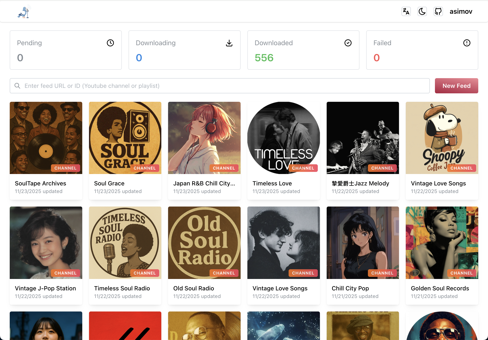
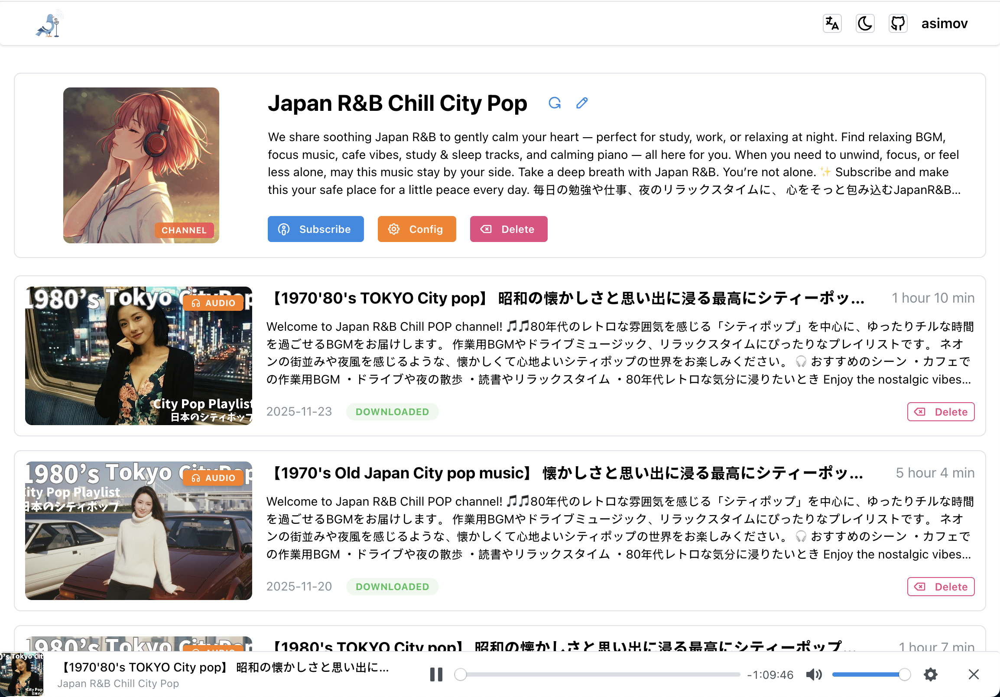

<div align="center">
  
  
  <h2>Ouça YouTube e Bilibili. Em qualquer lugar.</h2>
  <h3>Se auto-hospedagem não é sua praia, dê uma olhada em nossos próximos serviços online:
    <a target="_blank" href="https://pigeonpod.cloud/?utm_source=github&utm_medium=repo&utm_campaign=readme&utm_content=cta">PigeonPod</a>
  </h3>
</div>

<div align="center">
  
[English](../../README.md) | [简体中文](README-ZH.md) | [Español](README-ES.md) | [日本語](README-JA.md) | [Deutsch](README-DE.md) | [Français](README-FR.md) | [한국어](README-KO.md)
</div>

## Screenshots


<div align="center">
  <p style="color: gray">Lista de canais</p>
</div>


<div align="center">
  <p style="color: gray">Detalhes do canal</p>
</div>

## Funcionalidades Principais

- **🎯 Inscrição inteligente e pré-visualização**: Cole qualquer URL de canal ou playlist do YouTube ou Bilibili, detecte automaticamente o tipo e visualize o feed e os episódios antes de se inscrever.
- **📻 RSS seguro para qualquer cliente**: Gera links RSS padrão para canais e playlists, protegidos com API Key e compatíveis com qualquer aplicativo de podcasts.
- **🤖 Sincronização automática e histórico**: Sincroniza periodicamente novos envios em segundo plano, com quantidade inicial de episódios configurável por feed e carregamento de episódios históricos com um clique.
- **🎦 Saída de áudio/vídeo flexível**: Escolha entre downloads apenas de áudio (AAC) ou vídeo, com níveis de qualidade ou seleção de resolução/codificação, e incorporação automática de metadados, capítulos e capas.
- **🍪 Suporte a conteúdo restrito**: Use chaves da YouTube Data API e cookies enviados para acessar com mais confiabilidade conteúdo com restrição de idade e conteúdo exclusivo para membros.
- **📦 Download em lote de episódios históricos**: Projetado especificamente para baixar episódios históricos com eficiência, com busca, paginação, seleção por item ou por página e envio em um clique.
- **📊 Painel de downloads e ações em massa**: Painel em tempo real para tarefas Pendente/Baixando/Concluído/Com falha, com logs de erro e ações em massa de cancelar/excluir/tentar novamente com um clique.
- **🔍 Filtros e retenção por feed**: Filtre episódios por palavras‑chave no título/descrição (incluir/excluir), duração mínima e defina por feed o estado de sincronização e o número máximo de episódios a manter.
- **⏱ Download automático com atraso para novos episódios**: Configure janelas de atraso por feed para aumentar a taxa de sucesso do `--sponsorblock` em vídeos recém-publicados.
- **📈 Insights de uso da API do YouTube**: Monitore o uso de cota e os limites da API para planejar sincronizações e evitar interrupções inesperadas.
- **🎛 Feeds personalizáveis e player integrado**: Personalize título e capa por feed e utilize o player web integrado para ouvir rapidamente áudio ou vídeo.
- **🔄 Exportação de assinaturas em OPML**: Exporte todas as assinaturas como um arquivo OPML padrão para migrar facilmente entre diferentes clientes de podcast.
- **🧩 Gestão e controle de episódios**: Lista de episódios com scroll infinito, download manual de episódios individuais, nova tentativa, cancelamento e exclusão que também gerenciam os arquivos locais.
- **⬆️ Atualização do yt-dlp no app**: Atualize com um clique o runtime integrado do yt-dlp para manter a compatibilidade de extração e download sempre em dia.
- **🛠 Argumentos avançados do yt-dlp**: Adicione argumentos personalizados do yt-dlp com sintaxe padrão para ajustar com precisão o comportamento de download em casos avançados.
- **🌐 Interface multilíngue e responsiva**: Interface totalmente localizada (inglês, chinês, espanhol, português, japonês, francês, alemão e coreano) com layout responsivo para desktop e dispositivos móveis.
- **📚 Suporte a capítulos Podcasting 2.0**: Gera arquivos de capítulos `chapters.json` no padrão para que mais clientes de podcast exibam navegação por capítulos.

## Deploy

### Usando Docker Compose (Recomendado)

**Certifique-se de ter Docker e Docker Compose instalados na sua máquina.**

1. Use o arquivo de configuração docker-compose, modifique as variáveis de ambiente conforme suas necessidades:
```yml
version: '3.9'
services:
  pigeon-pod:
    image: 'ghcr.io/aizhimou/pigeon-pod:latest' 
    restart: unless-stopped
    container_name: pigeon-pod
    ports:
      - '8834:8080'
    environment:
      - SPRING_DATASOURCE_URL=jdbc:sqlite:/data/pigeon-pod.db # set to your database path
      # Opcional: desative a autenticacao integrada apenas se outra camada ja proteger a interface web
      # - PIGEON_AUTH_ENABLED=false
    volumes:
      - data:/data

volumes:
  data:
```

> [!WARNING]
> `PIGEON_AUTH_ENABLED` tem valor padrao `true`. Defina como `false` somente se outra camada confiavel ja proteger a interface web, como um auth proxy, controle de acesso no proxy reverso, VPN ou rede privada.
>
> Se voce desativar a autenticacao integrada, deve proteger o PigeonPod por outros meios. Nao exponha uma instancia com a autenticacao desativada diretamente a Internet publica.

2. Inicie o serviço:
```bash
docker-compose up -d
```

3. Acesse a aplicação:
Abra seu navegador e visite `http://localhost:8834` com **usuário padrão: `root` e senha padrão: `Root@123`**

### Executar com JAR

**Certifique-se de ter Java 17+ e yt-dlp instalados na sua máquina.**

1. Baixe o JAR da versão mais recente em [Releases](https://github.com/aizhimou/pigeon-pod/releases)

2. Crie o diretório de dados no mesmo diretório do arquivo JAR:
```bash
mkdir -p data
```

3. Execute a aplicação:
```bash
java -jar -Dspring.datasource.url=jdbc:sqlite:/path/to/your/pigeon-pod.db \  # configure o caminho do banco de dados
           pigeon-pod-x.x.x.jar
```

4. Acesse a aplicação:
Abra seu navegador e visite `http://localhost:8080` com **usuário padrão: `root` e senha padrão: `Root@123`**

## Storage Configuration

- PigeonPod supports `LOCAL` and `S3` storage modes.
- You can only enable one mode at a time.
- S3 mode supports MinIO, Cloudflare R2, AWS S3, and other S3-compatible services.
- Switching storage mode does not migrate historical media automatically. You must migrate files manually.

### Storage Quick Comparison

| Mode | Pros | Cons |
| --- | --- | --- |
| `LOCAL` | Easy setup, no external dependency | Uses local disk, harder to scale |
| `S3` | Better scalability, suitable for cloud deployment | Requires object storage setup and credentials |

## Documentação

- [Como obter a chave da API do YouTube](../how-to-get-youtube-api-key/how-to-get-youtube-api-key-en.md)
- [Como configurar cookies do YouTube](../youtube-cookie-setup/youtube-cookie-setup-en.md)
- [Como obter o ID do canal do YouTube](../how-to-get-youtube-channel-id/how-to-get-youtube-channel-id-en.md)

## Stack Tecnológico

### Backend
- **Java 17** - Linguagem principal
- **Spring Boot 3.5** - Framework da aplicação
- **MyBatis-Plus 3.5** - Framework ORM
- **Sa-Token** - Framework de autenticação
- **SQLite** - Banco de dados leve
- **Flyway** - Ferramenta de migração de banco de dados
- **YouTube Data API v3** - Recuperação de dados do YouTube
- **yt-dlp** - Ferramenta de download de vídeos
- **Rome** - Biblioteca de geração RSS

### Frontend
- **Javascript (ES2024)** - Linguagem principal
- **React 19** - Framework da aplicação
- **Vite 7** - Ferramenta de build
- **Mantine 8** - Biblioteca de componentes UI
- **i18next** - Suporte à internacionalização
- **Axios** - Cliente HTTP

## Guia de Desenvolvimento

### Requisitos do Ambiente
- Java 17+
- Node.js 22+
- Maven 3.9+
- SQLite
- yt-dlp

### Desenvolvimento Local

1. Clone o projeto:
```bash
git clone https://github.com/aizhimou/PigeonPod.git
cd PigeonPod
```

2. Configure o banco de dados:
```bash
# Crie o diretório de dados
mkdir -p data/audio

# O arquivo do banco de dados será criado automaticamente na primeira inicialização
```

3. Configure a API do YouTube:
   - Crie um projeto no [Google Cloud Console](https://console.cloud.google.com/)
   - Habilite a YouTube Data API v3
   - Crie uma chave da API
   - Configure a chave da API nas configurações do usuário

4. Inicie o backend:
```bash
cd backend
mvn spring-boot:run
```

5. Inicie o frontend (novo terminal):
```bash
cd frontend
npm install
npm run dev
```

6. Acesse a aplicação:
- Servidor de desenvolvimento frontend: `http://localhost:5173`
- API backend: `http://localhost:8080`

### Observações de Desenvolvimento
1. Certifique-se de que o yt-dlp esteja instalado e disponível na linha de comando
2. Configure corretamente a chave da API do YouTube
3. Garanta que o diretório de armazenamento de áudio tenha espaço em disco suficiente
4. Limpe regularmente arquivos de áudio antigos para economizar espaço

---

<div align="center">
  <p>Feito com ❤️ para os entusiastas de podcasts!</p>
  <p>⭐ Se você curte o PigeonPod, deixe uma estrela no GitHub!</p>
</div>
