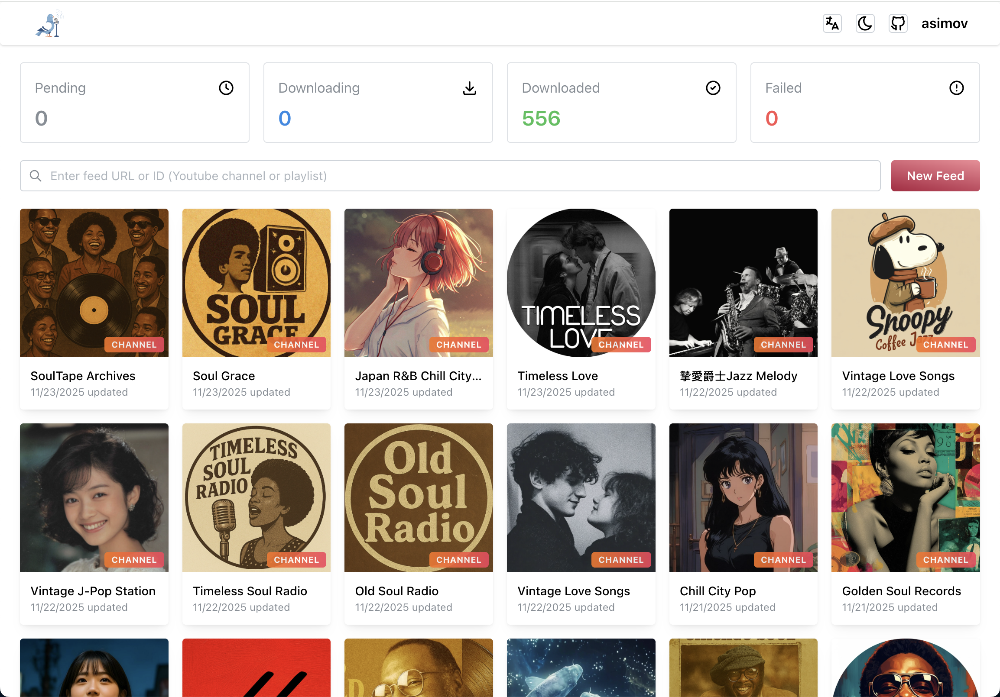
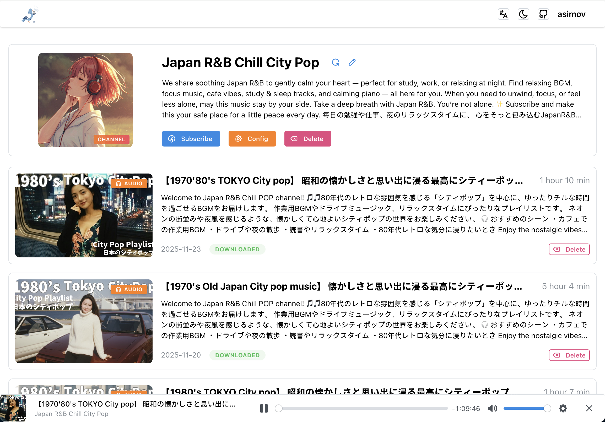

<div align="center">
  
  <h1>PigeonPod</h1>
  <h2>简单优雅的将你喜爱的 YouTube 频道转换为播客频道。</h2>
  <h3>如果自托管不是你的菜，欢迎看看我们即将上线的在线服务：
    <a target="_blank" href="https://pigeonpod.cloud/">PigeonPod</a>
  </h3>
</div>

<div align="center">
  
[](../../README.md) [](README-ES.md) [](README-PT.md) [](README-JA.md) [](README-DE.md) [](README-FR.md) [](README-KO.md)
</div>

## Screenshots


<div align="center">
  <p style="color: gray">订阅列表</p>
</div>


<div align="center">
  <p style="color: gray">节目详情</p>
</div>

## 核心功能

- **🎯 智能订阅与预览**：粘贴任意 YouTube 频道或播放列表链接，自动识别类型，并在订阅前预览订阅详情与节目列表。
- **🤖 自动同步与历史补齐**：后台定时增量同步新视频，可按订阅配置初始同步集数，并支持一键补齐历史节目。
- **📻 安全的 RSS 播客订阅**：为频道和播放列表生成标准 RSS 订阅链接，支持 API Key 访问保护，可在任何播客客户端中使用。
- **🔍 按订阅精细过滤与保留策略**：按标题/描述关键词（包含/排除）、最小时长过滤，并可为每个订阅单独设置同步开关和最大保留集数。
- **📊 下载面板与批量操作**：实时下载任务面板，按待下载/下载中/完成/失败分类展示，并支持错误日志查看及一键批量取消/删除/重试。
- **🧩 节目管理与控制**：支持无限滚动浏览节目列表，手动触发单集下载、重试、取消与删除操作，同时联动清理对应的本地文件。
- **🎦 灵活的音视频输出**：按订阅选择仅音频（AAC）或视频下载，支持音质档位或分辨率/编码可选，并自动嵌入元数据、章节与封面。
- **🍪 受限内容支持**：结合 YouTube Data API Key 与上传的 Cookies，更稳定地访问年龄限制与会员专属内容。
- **🎛 可定制订阅与内置播放器**：为每个订阅自定义标题与封面，并通过内置网页播放器快速试听音频或视频。
- **🌐 多语言自适应界面**：完整支持中/英/西/葡/日/法/德/韩八种语言界面，自适应布局在桌面与移动端均有出色体验。

## 部署方式

### 使用 Docker Compose（推荐）

**确保你的机器上已安装 Docker 和 Docker Compose。**

1. 使用 docker-compose 配置文件，注意根据自己的需求修改环境变量
```yml
version: '3.9'
services:
  pigeon-pod:
    image: 'ghcr.io/aizhimou/pigeon-pod:latest'
    container_name: pigeon-pod
    ports:
      - '8834:8080'
    environment:
      - 'PIGEON_BASE_URL=https://pigeonpod.cloud' # 替换为你的域名。注意：如果您在使​​用过程中更改了此域名，您之前的订阅链接将失效。
      - 'PIGEON_AUDIO_FILE_PATH=/data/audio/' # 替换为你的音频文件路径
      - 'PIGEON_COVER_FILE_PATH=/data/cover/' # 替换为你的自定义封面文件路径
      - 'SPRING_DATASOURCE_URL=jdbc:sqlite:/data/pigeon-pod.db' # 替换为你的数据库路径
    volumes:
      - data:/data

volumes:
  data:
```

2. 启动服务
```bash
docker-compose up -d
```

3. 访问应用
打开浏览器访问 `http://{localhost}:8834`，**默认用户名: `root`，密码：`Root@123`**

### 使用 JAR 包运行
**确保你的机器上已安装 Java 17+ 和 yt-dlp。**
1. 从 [Releases](https://github.com/aizhimou/pigeon-pod/releases) 下载最新的发布 JAR 包

2. 在与 JAR 包相同的目录下创建数据目录
```bash
mkdir -p data
```

3. 运行应用
```bash
java -jar -DPIGEON_BASE_URL=http://localhost:8080 \  # 替换为你的域名。注意：如果您在使​​用过程中更改了此域名，您之前的订阅链接将失效。
           -DPIGEON_AUDIO_FILE_PATH=/path/to/your/audio/ \  # 替换为你的音频文件路径
           -Dspring.datasource.url=jdbc:sqlite:/path/to/your/pigeon-pod.db \  # 替换为你的数据库路径
           pigeon-pod-x.x.x.jar
```

4. 访问应用
打开浏览器访问 `http://localhost:8080`，**默认用户名: `root`，密码：`Root@123`**

## 文档

- [如何获取 YouTube Data API 密钥](../how-to-get-youtube-api-key/how-to-get-youtube-api-key-zh.md)
- [如何配置 YouTube Cookies](../youtube-cookie-setup/youtube-cookie-setup-zh.md)
- [如何获取 YouTube 频道 ID](../how-to-get-youtube-channel-id/how-to-get-youtube-channel-id-en.md)


## 技术栈

### 后端
- **Java 17** - 核心语言
- **Spring Boot 3.5** - 应用框架
- **MyBatis-Plus 3.5** - ORM 框架
- **SQLite** - 轻量级数据库
- **Flyway** - 数据库版本管理工具
- **Sa-Token** - 权限认证框架
- **YouTube Data API v3** - YouTube 数据获取
- **yt-dlp** - 视频下载工具
- **Rome** - RSS 生成库

### 前端
- **Javascript (ES2024)** - 核心语言
- **React 19** - 应用框架
- **Vite 7** - 构建工具
- **Mantine 8** - UI 组件库
- **i18next** - 国际化支持
- **Axios** - HTTP 客户端

## 开发指南

### 环境要求
- Java 17+
- Node.js 22+
- Maven 3.9+
- SQLite
- yt-dlp

### 本地开发

1. 克隆项目
```bash
git clone https://github.com/aizhimou/PigeonPod.git
cd PigeonPod
```

2. 配置数据库
```bash
# 创建数据目录
mkdir -p data/audio

# 数据库文件会在首次启动时自动创建
```

3. 配置 YouTube API
   - 在 [Google Cloud Console](https://console.cloud.google.com/) 创建项目
   - 启用 YouTube Data API v3
   - 创建 API 密钥
   - 在用户设置中配置 API 密钥

4. 启动后端
```bash
cd backend
mvn spring-boot:run
```

5. 启动前端（新终端）
```bash
cd frontend
npm install
npm run dev
```

6. 访问应用
- 前端开发服务器: `http://localhost:5173`
- 后端 API: `http://localhost:8080`

### 开发注意事项
1. 确保 yt-dlp 已安装并可在命令行中使用
2. 配置正确的 YouTube API 密钥
3. 确保音频存储目录有足够的磁盘空间
4. 定期清理旧的音频文件以节省空间

---

<div align="center">
  <p>为播客爱好者用 ❤️ 制作！</p>
  <p>⭐ 如果你喜欢 PigeonPod，请在 GitHub 上给我们一个星！</p>
</div>
